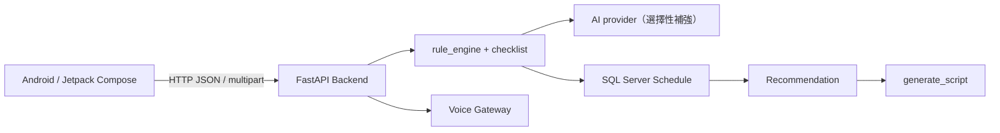

# AI 智慧醫療掛號導引系統

這是淡江大學資訊管理相關專題。系統透過 Android 問診介面收集症狀、危險徵兆與可看診時間，由 FastAPI Backend 控制問診流程與安全檢查，再依 SQL Server 的真實班表推薦科別、醫師與時段，並產生後續掛號導引步驟。

> 正式 runtime 只有 `backend/` 與 `android/`。project-smart 的部分關鍵字概念已移植到正式 Backend adapter；repository 不再包含獨立的 reference source 資料夾。

## 已完成的主要功能

- 四種 canonical `VisitType`：`initial`、`followup`、`quick_search`，以及相容用 `return_visit`。
- 初診與複診的 Batch triage：一次顯示多題，以 keyed `answers` 一次 POST。
- deterministic checklist、red flag safety gate、確認與修改流程。
- 科別判斷、SQL 班表查詢、醫師專長／時間雙欄排序與無班表狀態。
- 快速查詢跳過症狀問診與 AI，直接呼叫 `/schedules/search`；`/followup/recommend` 保留為相容 contract。
- 正式 Runtime LLM 統一為 Cerebras `gpt-oss-120b`；AI 失敗時保留 deterministic fallback。
- 國語／台語 ASR、TTS gateway 與 Android 系統 TTS 降級路徑。
- 歷史紀錄、推薦選擇、`/generate_script` 與 Accessibility 視覺導引。

## 整體架構



Android 負責 UI、navigation、輸入與顯示；Backend 才是問診狀態、安全 gate、科別與推薦邏輯的正式來源。SQL Server 提供 `Schedule` 班表，AI 只在允許的位置協助文字理解或排序，不能決定流程是否完成。

## 三種使用者就診流程

| 使用者選擇 | Android 流程 | SQL `Schedule.visit_type` |
|---|---|---|
| `initial` | `VisitTypeSelection → Chat` | 初診 |
| `followup` | `VisitTypeSelection → Chat` | 複診 |
| `quick_search` | `VisitTypeSelection → QuickSearchScreen` | 複診 |

目前 SQL 實際資料模型只有「初診／複診」；快速查詢直接以 `GET /schedules/search` 查詢複診班表，不進問診或一般推薦流程。`return_visit` 仍保留為相容用 canonical value／route alias，Android route 會導向 `QuickSearchScreen`；一般推薦服務仍會做 strict visit type filter，不得跨類型推薦。

## Batch triage、AI 與推薦

`batch_question_service` 依 `rule_engine` 的缺漏 checklist 組成最多六題；Android 以欄位 key 收集答案，再由 `batch_extraction_service` 先 deterministic parse，只有模糊欄位才可能呼叫設定的 AI provider。這降低 API calls 與 quota 使用，也改善逐題等待的 UX。

推薦必須經過完成問診、使用者確認、科別判斷、visit type 與日期／時段可行性篩選。查無相符班表時顯示空狀態，不建立假醫師。

## Voice

Backend 提供 `/voice/asr`、`/voice/chat`、`/voice/tts`、`/voice/health`，實際語音處理由外部 Voice Gateway 執行。ASR 曾完成 runtime 驗證；中文 TTS 下游服務未啟動時可安全降級，但完整外部 TTS 可用性仍取決於部署環境。

## 主要資料夾

- `backend/`：唯一正式 FastAPI Backend、SQL adapter 與測試。
- `android/`：唯一正式 Android App、Compose UI 與單元測試。
- `scripts/`：Windows setup、Backend 與測試快捷腳本。
- `docs/`：架構、操作、測試、限制與交接文件。

## 建議閱讀順序

第一次接手請先讀：

1. [目前專案狀態](docs/PROJECT_STATUS.md)
2. [系統架構](docs/ARCHITECTURE.md)
3. [AI／Codex 交接指南](docs/AI_AGENT_HANDOFF.md)

再依工作範圍閱讀 [Backend](docs/BACKEND.md)、[Android](docs/ANDROID.md) 或 [AI 問診設計](docs/AI_TRIAGE.md)。

## 最短啟動方式

目前示範環境由手機經 Tailscale 連至 310 電腦，並在該電腦以 PowerShell 啟動 FastAPI。Windows PowerShell：

```powershell
.\scripts\setup.ps1
.\scripts\run-backend.ps1 -Port 8080 -HostName 0.0.0.0
```

另一個終端確認：

```powershell
Invoke-RestMethod http://127.0.0.1:8080/health
cd android
.\gradlew.bat assembleDebug --no-daemon
```

手機端在 ignored 的 `android/local.properties` 設定 310 電腦的 Tailscale 位址；Android Emulator 則使用 `10.0.2.2` 連回 host。完整環境設定請見 [安裝與啟動](docs/SETUP_AND_RUN.md)。`.env` 與 `android/local.properties` 只留本機，禁止 commit。

## 測試狀態

本分支整理後的最新完整結果記錄於 [測試指南](docs/TESTING.md)。Backend 使用 `pytest`，Android 使用 Gradle unit test，並以 `assembleDebug` 驗證 APK build。

## Known limitations 摘要

- Cerebras adapter 與 `gpt-oss-120b` 設定已存在，但尚未以正式可用 Key 完成真實 API smoke test。
- 中文 TTS 依賴外部 downstream service；服務未啟動時只能降級。
- case store 是 in-memory，不適合重啟保存或多 worker。
- Accessibility／實際院方 App 自動掛號仍需要完整實機端到端驗證。

詳見 [Known Issues](docs/KNOWN_ISSUES.md)。

## 文件索引

- [PROJECT_STATUS](docs/PROJECT_STATUS.md)：目前做到哪裡。
- [ARCHITECTURE](docs/ARCHITECTURE.md)：系統與資料流架構。
- [BACKEND](docs/BACKEND.md)：FastAPI routes、services 與 state。
- [ANDROID](docs/ANDROID.md)：Compose、navigation、ViewModel 與 network。
- [AI_TRIAGE](docs/AI_TRIAGE.md)：deterministic state machine 與 AI 邊界。
- [SETUP_AND_RUN](docs/SETUP_AND_RUN.md)：Windows、SQL、Emulator、Voice、AI 設定。
- [TESTING](docs/TESTING.md)：測試指令、結果與 runtime checklist。
- [KNOWN_ISSUES](docs/KNOWN_ISSUES.md)：已知限制與優先級。
- [AI_AGENT_HANDOFF](docs/AI_AGENT_HANDOFF.md)：GPT／Codex 接手規則。
- [CONTRIBUTING](CONTRIBUTING.md)：人類組員 Git 協作方式。
