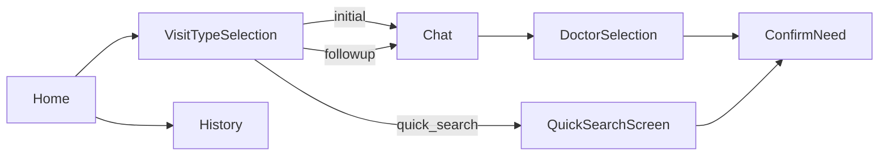

# Android 指南

正式 Android App 位於 `android/`，使用 Kotlin、Jetpack Compose、Navigation Compose、ViewModel／StateFlow 與原生 `HttpURLConnection`。

- `namespace`：`com.example.medicalaiguidance`
- `applicationId`：`com.example.medicalaiguidance`
- `minSdk`：24
- `targetSdk`：36
- Java compatibility：11

## Navigation

`NavGraph.kt` 是 route 定義與 navigation graph 的主要入口。`VisitPlan.kt` 保存三種 canonical API value；`UNKNOWN` 只做相容與防呆，不能靜默當成 `initial`。

## 主要 screens

- `HomeScreen.kt`：首頁、問診入口與歷史入口。
- `VisitTypeSelectionScreen.kt`：初診／複診／快速查詢選擇。
- `ChatScreen.kt`：訊息、Batch form、single-message fallback、red flag warning、voice、確認／修改。
- `QuickSearchScreen.kt`：從正式科別清單選擇科別、日期與時段，查詢可掛號的複診班表；不呼叫 AI 問診。
- `DoctorSelectionScreen.kt`：專長／時間推薦欄位、detail、loading/error 與 NoSlots。
- `ConfirmNeedScreen.kt`：選定 recommendation 後的確認與 script 流程。
- `HistoryScreen.kt`：本機歷史與唯讀舊紀錄。

## ViewModels

- `ChatViewModel.kt`：case、VisitType、Batch questions/answers、confirmation、history、voice 與 TTS fallback UI state。
- `DoctorViewModel.kt`：依 case/visit type 呼叫 recommendation，將空結果轉成 `NoSlots`，處理選擇與 script。
- `QuickSearchViewModel.kt`：載入正式科別、驗證快速查詢條件並呼叫 `/schedules/search`。
- `HistoryViewModel.kt`：歷史清單與刪除。
- `ConfirmViewModel.kt`：載入已確認的 appointment。
- `HomeViewModel.kt`：首頁狀態。

## Repository 與 network

`MedicalRepository.kt` 是 Android 資料操作入口：包裝 chat、Batch、confirm、recommend、followup、script、voice APIs，並保存目前 case／visit type／recommendation。History 使用 SharedPreferences JSON 與 `StateFlow`，不是 Backend case store。

`MedicalApiClient.kt` 實作：

- JSON：`/chat`、`/recommend`、`/followup/recommend`、`/generate_script`、`/voice/tts`
- multipart：`/voice/chat`、`/voice/asr`
- HTTP 409／400／503 的使用者訊息映射
- Emulator API base URL 與 timeout

`MedicalDtos.kt` 對應 Backend Pydantic schemas，包含 `ChatRequest`、`BatchAnswerDto`、`TriageResultDto`、recommendation、followup、script 與 voice DTO。API contract 修改時必須同步兩端並補測試。

## Batch 與 single-message

當 response 有 `questionBatch`，`ChatScreen` 顯示 keyed 多欄表單；`ChatViewModel.submitBatchAnswers()` 先檢查 required keys，再以單一 request 送出。下一批完全採 Backend response，不由 Android 自行推測。

當 Backend 關閉 `BATCH_TRIAGE_ENABLED` 或 response 沒有 batch，底部單一訊息輸入仍可使用。歷史紀錄畫面為唯讀，不可從舊紀錄重新送出 doctor action。

## Confirmation、NoSlots 與安全

- checklist 完成後才顯示「修改／看推薦」決策。
- confirm request 沿用原 case 的 visit type。
- recommendation 空集合或 503 顯示 NoSlots，不建立本機假 appointment。
- Backend warning 顯示為 urgent warning card；Android 不自行解除 red flag gate。

## Voice

App 有錄音、測試音檔 ASR、`/voice/chat`、訊息 TTS 與播放狀態。Gateway TTS 失敗時可嘗試中文 fallback，再降級到 Android system TTS。Batch UI 目前沒有每個欄位各自的 mic button。

## Accessibility／generate script

`ConfirmNeedScreen.kt` 會以選定的 recommendation 呼叫 `MyAccessibilityService.updateTarget()`，接著啟動第三方榮總 App（package `tw.com.bicom.VGHTPE`）。`MyAccessibilityService.kt` 監看指定 package、解析 Accessibility 節點，並由 `OverlayManager.kt` 顯示視覺導引。若榮總 App 未安裝，畫面會開啟院方網站作為一般外部 fallback；網站不是 Backend 架構元件。真實院方 App 的完整自動掛號仍需實機端到端確認。

環境與 build 見 [SETUP_AND_RUN](SETUP_AND_RUN.md)，測試見 [TESTING](TESTING.md)。
