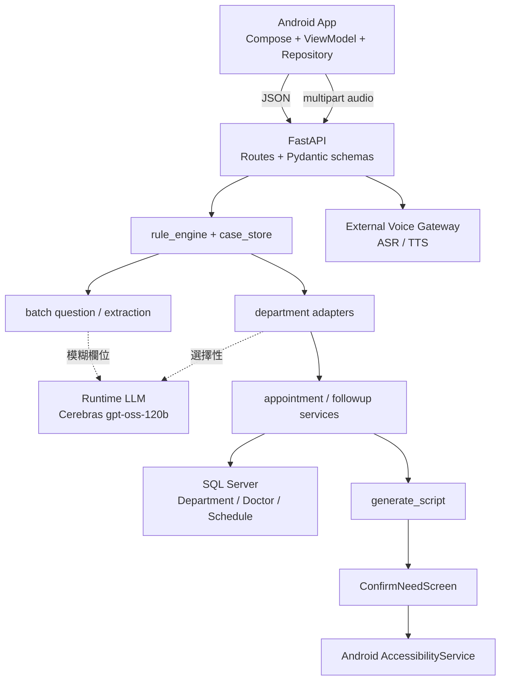
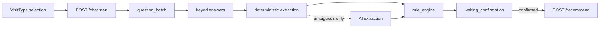
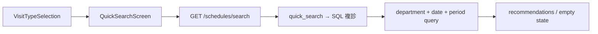

# 系統架構

本文件描述目前實際程式結構。正式 runtime 是 `android/` 與 `backend/`；project-smart 關鍵字概念已整合在正式 Backend adapter 中。

## 整體架構

## 核心責任

- Android：畫面、navigation、輸入驗證、API DTO、顯示與本機歷史。
- FastAPI：API contract、case workflow、red flag、安全 gate、推薦與語音 gateway orchestration。
- SQL Server：科別、醫師與 Schedule 班表的真實資料來源。
- AI provider：只在設定允許且有 Key 時做語意補強；失敗時不得破壞 deterministic flow。
- Voice Gateway：外部 ASR／TTS；不是 FastAPI process 內的模型。
- `generate_script`：驗證已儲存的 recommendation 並產生掛號導引 steps；Android 確認後由本機 Accessibility 流程執行視覺導引。

## Batch triage flow

`batch_question_service` 不另建 state machine，只把 `rule_engine.missing_checklist_fields()` 的結果分組。`batch_extraction_service` 對一批答案最多呼叫一次 provider，且 AI 不能標記 `red_flags_checked`。

## Quick search flow and return-visit compatibility

快速查詢不經 symptom checklist 或 AI 問診。Android 的 `RETURN_VISIT` route 目前只是導向 `QuickSearchScreen` 的相容 alias；Backend 仍保留 `/followup/recommend` 與 canonical `return_visit` contract，但舊 `ReturnVisitScreen`／`ReturnVisitViewModel` 已退出正式 UI runtime。

## Recommendation flow

1. `/chat` 完成 checklist 與使用者確認。
2. `detect_department_result()` 依序嘗試 project-smart concept adapter、AI/RAG adapter、deterministic rule fallback。
3. `appointment_service` 將 canonical visit type 映射到 SQL 值。
4. `db.py` 使用參數化 `AND s.visit_type = ?` 查詢、排除停診與 placeholder doctor。
5. `schedule_filter` 套用日期／時段／指定醫師可行性。
6. `specialty_scoring` 與時間分數產生兩組最多五筆結果。
7. 無符合班表時回空結果／503，Android 顯示 NoSlots，不建立假醫師。

## State 與資料真相

- 問診流程與安全規則的 source of truth：`backend/app/services/rule_engine.py`。
- runtime case/recommendation 暫存：`backend/app/services/case_store.py`（in-memory）。
- request/response contract：`backend/app/schemas.py` 與 Android `MedicalDtos.kt`。
- 班表真相：SQL Server `Schedule`；DB 失敗或查無資料時回空結果／錯誤，不使用 JSON 或 mock schedule fallback。
- Android 當前 UI state：各 ViewModel 的 `StateFlow`；不可反向覆寫 Backend workflow state。

## Voice 與 Accessibility

`/voice/chat` 執行 ASR 後呼叫同一個 `/chat` handler，再嘗試 TTS。TTS 失敗會回 `tts_failed=true`，Android 可用中文 gateway fallback 或系統 TTS。`/generate_script` 只能對 case store 中已存在的 recommendation 建立 steps；選擇結果進入 `ConfirmNeedScreen` 後，畫面呼叫 `MyAccessibilityService.updateTarget()` 並啟動第三方榮總 App。AccessibilityService 監看指定 package、解析節點，並透過 overlay 顯示視覺導引；若 App 未安裝，Android 會開啟院方網站作為一般外部 fallback。

## Ports

| 元件 | 建議／預設 | 說明 |
|---|---|---|
| FastAPI | `127.0.0.1:8080` | 與 Android default `API_BASE_URL` 對齊；`run-backend.ps1` 本身預設 8000，啟動時需傳 `-Port 8080` |
| Android Emulator → host | `http://10.0.2.2:8080` | `10.0.2.2` 是 Emulator 對 host loopback 的入口 |
| Voice Gateway | `http://localhost:8000` | Backend `VOICE_GATEWAY_URL` 的程式預設；可由環境設定覆寫 |

不要把任何 API key 寫進架構圖、文件或 source。
