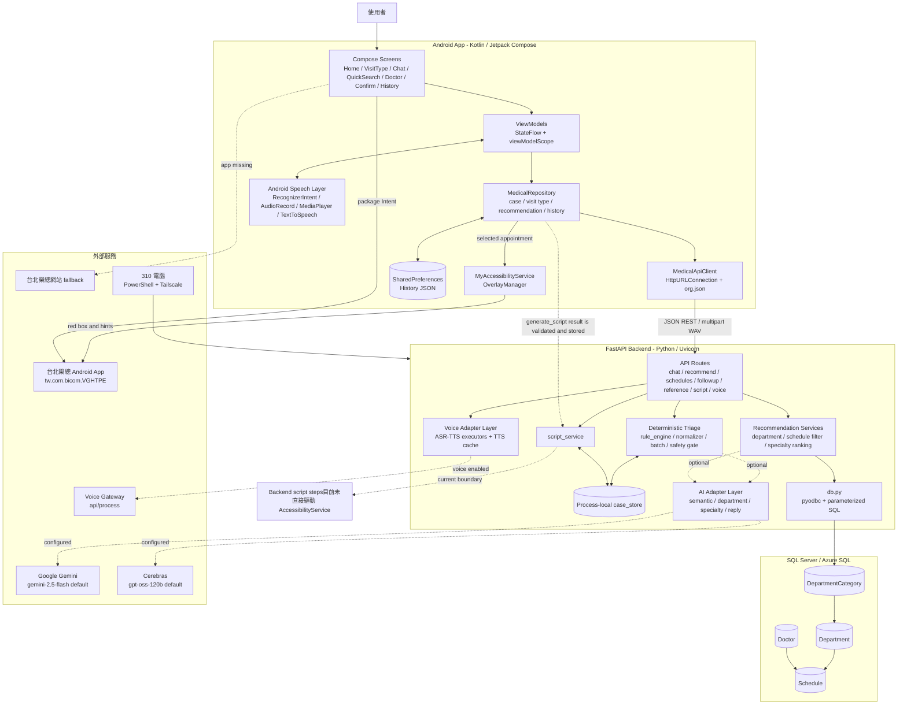

# 1. 系統整體概要

> 維護註記（2026-09-13）：本文件保留建立當時的稽核證據與歷史決策；其中原始 branch／working-tree 狀態與 Render 部署段落屬歷史快照。現行示範環境為手機經 Tailscale 連至 310 電腦上由 PowerShell 啟動的 FastAPI，舊 ReturnVisit UI、MockSchedule 開發頁及 Backend JSON/mock fallback 已於後續 legacy cleanup 移除。

## 分析基準與證據邊界

- 本報告只根據目前 repository 的實際程式碼、Gradle、requirements、PowerShell scripts、測試、Git history 與目前工作樹分析，未以既有說明文件中的願景取代程式碼事實。
- 分析時目前分支為 `codex0904`，`HEAD` 為 `1da563d`（`feat: improve voice ASR priority and TTS prefetch`）。
- 目前工作樹有 5 個尚未 commit 的 Android 修改，已納入本報告：
  - `android/app/src/main/java/com/example/medicalaiguidance/screen/GettingStartedScreen.kt`
  - `android/app/src/main/java/com/example/medicalaiguidance/screen/HomeScreen.kt`
  - `android/app/src/main/java/com/example/medicalaiguidance/screen/VisitTypeSelectionScreen.kt`
  - `android/app/src/main/java/com/example/medicalaiguidance/service/CancellationGuidance.kt`
  - `android/app/src/main/java/com/example/medicalaiguidance/service/MyAccessibilityService.kt`
- 工作樹另有一項既存、尚未 commit 的刪除：追蹤檔 `CEREBRAS_RUNTIME_VALIDATION_REPORT.md` 已不在目前工作樹。它是驗證報告而非 runtime 程式或設定，因此本報告只記錄其刪除狀態，不把已刪除內容當成現行系統證據，也沒有將它還原。
- 正式 runtime 程式位於 `android/` 與 `backend/`。本文件建立時曾參考獨立的 project-smart source；該資料夾目前已移除，正式後端只保留移植到 `backend/app/services/project_smart_department_adapter.py` 的部分關鍵字概念。
- 本次沒有連線 SQL Server、Voice Gateway、Gemini 或 Cerebras，也沒有呼叫任何外部 AI API。因此本報告只確認「程式碼中已實作的 adapter、契約與 fallback」，不宣稱外部服務目前可用。

## 系統實際用途

本系統是 Android 醫療掛號導引 App。使用者可選擇初診、複診，或目前介面稱為「快速查詢」的回診查詢流程。初診與複診會先進行症狀、危險徵兆、部位、持續時間、嚴重程度及可看診日期／時段的資料蒐集；FastAPI 後端用 deterministic rule engine 控制問題順序、急迫性判斷與確認狀態，可選擇性使用 AI 做語意補強、科別判斷、醫師專長評分與回覆文字改寫。完成確認後，後端從 SQL Server 的正式班表查詢可掛號的科別、醫師與時段，產生「專長優先」及「時間優先」兩組推薦。

使用者選定推薦後，後端產生掛號導引 script。Android 顯示掛號資訊，清理語音暫存 session，透過 package intent 開啟台北榮總 App（package `tw.com.bicom.VGHTPE`）；若開啟智慧視覺導引，Android AccessibilityService 依選定的科別、子科別、日期、時段與醫師，在院方 App 上顯示紅框或捲動提示。院方 App 未安裝時，程式會開啟台北榮總網站。

## 目前實際存在的主要功能

- **Android App 前端**：首頁、使用說明、就診類型選擇、問診聊天、快速查詢、醫師推薦、掛號確認與歷史紀錄。
- **使用者流程**：`Home → VisitTypeSelection → Chat → DoctorSelection`，或 `Home → VisitTypeSelection → QuickSearch`；選定班表後皆可進 `ConfirmNeed → 台北榮總 App`。
- **問診／資料蒐集**：支援 single-message 多輪問答，以及由 `BATCH_TRIAGE_ENABLED` 控制的 keyed Batch triage；預設設定檔值為 `false`，所以是否實際採 Batch 取決於執行環境。
- **安全規則**：危險徵兆否定語意、紅旗症狀、問題嘗試次數、信心值、確認／修改 gate、急迫性分數與警示。
- **REST API**：健康檢查、問診、推薦、回診推薦、正式科別／醫師主資料、導引 script、ASR、TTS、語音健康檢查與 TTS session cleanup。
- **科別判斷**：依序嘗試 project-smart 概念 adapter、一般 AI 科別 adapter，失敗時使用 deterministic 關鍵字規則；AI 回傳的科別必須存在於後端取得的 active department list。
- **推薦功能**：SQL 班表的科別、visit type、狀態、日期／時段及 placeholder 過濾；醫師專長與時間雙排序；每欄最多 5 筆。
- **AI 功能**：Google Gemini 與 Cerebras provider abstraction、語意補強、Batch 模糊欄位抽取、科別判斷、醫師專長評分、問診回覆文字改寫，以及 timeout／缺 Key／格式錯誤時的 deterministic fallback。
- **資料庫功能**：以 `pyodbc` 讀取 SQL Server 的 `DepartmentCategory`、`Department`、`Doctor`、`Schedule`。正式後端程式中沒有 `INSERT`、`UPDATE`、`DELETE` 或 schema migration。
- **快速查詢**：從正式 DB API 載入科別，依精確科別、日期及時段查複診班表，跳過症狀問診與 AI；`RETURN_VISIT` route 只保留為導向同一畫面的相容 alias。
- **語音功能**：國語使用 Android `RecognizerIntent`；台語使用 `AudioRecord` 錄製 16 kHz、mono、PCM 16-bit WAV，再送 `/voice/asr`；TTS 透過 Voice Gateway，失敗時先由台語降級為後端國語 TTS，再降級為 Android `TextToSpeech`。
- **語音效能控制**：Android 單一問診 session 預取、共享進行中的 TTS、30 分鐘 TTL；Backend 以 process-local TTS cache、ASR／TTS 分離的 thread pools 與 ASR 優先 admission 降低互相等待。
- **歷史紀錄**：Android 使用 `SharedPreferences` 保存聊天、完成狀態、visit type、推薦快照與選定推薦；完成紀錄以唯讀方式開啟。
- **取消掛號導引**：首頁可啟動取消掛號 Accessibility 流程；目前未 commit 修改會在使用者點到「確認取消掛號」後才顯示成功，避免把放棄動作誤判為成功。
- **院方 App 視覺導引**：依 Accessibility node 的文字、座標、可視範圍、日期、診次、醫師與畫面狀態顯示紅框或提示；不會替使用者自動填入身分證、姓名或生日。

---

# 2. 系統技術清單

| 類別 | 技術／工具 | 實際用途 | 相關檔案 | 可確認版本 |
| -- | ----- | ---- | ---- | ----- |
| Android 應用 | Android application module | 唯一正式行動前端；application id `com.example.medicalaiguidance` | `android/app/build.gradle.kts`、`AndroidManifest.xml` | App `1.0`；versionCode `1` |
| Android SDK | Android SDK | 編譯與裝置 API；網路、錄音、語音、MediaPlayer、AccessibilityService、SharedPreferences | `android/app/build.gradle.kts` | compileSdk `36.1`、targetSdk `36`、minSdk `24` |
| Android Build Plugin | Android Gradle Plugin | Android module build plugin | `android/gradle/libs.versions.toml` | `9.0.0` |
| Kotlin | Kotlin 與 Kotlin Compose plugin | Android 主程式語言、coroutines、StateFlow、Compose UI | `android/gradle/libs.versions.toml`、`android/app/src/main/java/**/*.kt` | `2.2.10` |
| JVM | Java／JDK toolchain | 執行 Gradle daemon；Android bytecode source／target compatibility | `android/gradle/gradle-daemon-jvm.properties`、`android/app/build.gradle.kts` | toolchain JDK `21`；Java compatibility `11` |
| Gradle | Gradle Wrapper | Android build、unit test、APK 組裝 | `android/gradle/wrapper/gradle-wrapper.properties`、`gradlew*` | `9.4.1` |
| Toolchain resolver | Foojay Resolver Convention | Gradle JVM toolchain resolver | `android/settings.gradle.kts` | `1.0.0` |
| UI Framework | Jetpack Compose + Material 3 | 全部 screen 的 declarative UI、dialog、list、card、state rendering | `android/app/build.gradle.kts`、`screen/*.kt` | Compose BOM `2024.09.00`；個別 Compose／Material 3 版本無法由目前檔案確認 |
| Android Navigation | Navigation Compose | `NavHost`、route 與畫面切換 | `NavGraph.kt`、`android/app/build.gradle.kts` | `2.7.7` |
| Android Lifecycle | Lifecycle Runtime KTX、ViewModel、StateFlow | ViewModel scope、UI state 與 history state | `libs.versions.toml`、`viewmodel/*.kt` | lifecycle-runtime-ktx `2.10.0`；ViewModel 個別 artifact 版本無法由目前檔案確認 |
| Android Activity | Activity Compose | `ComponentActivity.setContent` | `MainActivity.kt`、`libs.versions.toml` | `1.13.0` |
| Android 基礎套件 | AndroidX Core KTX | Android Kotlin extensions | `libs.versions.toml` | `1.18.0` |
| Android HTTP Client | `java.net.HttpURLConnection` | JSON GET／POST 與 multipart WAV 上傳 | `MedicalApiClient.kt` | JDK／Android platform API；版本無法由目前檔案確認 |
| Android JSON | `org.json.JSONObject`／`JSONArray` | 手動序列化 snake_case request 與解析 response | `MedicalDtos.kt`、`MedicalRepository.kt` | Android runtime 版本無法由目前檔案確認；JVM test artifact `20240303` |
| Kotlin Coroutines | coroutines、StateFlow、`Dispatchers.IO` | 非同步 HTTP、ViewModel、TTS session 與狀態流 | `viewmodel/*.kt`、`repository/*.kt` | runtime 版本無法由目前檔案確認；`kotlinx-coroutines-test` `1.9.0` |
| Android 國語 ASR | `RecognizerIntent.ACTION_RECOGNIZE_SPEECH` | 國語辨識結果填入可編輯文字草稿 | `ChatScreen.kt` | Android platform API；版本無法由目前檔案確認 |
| Android 錄音 | `AudioRecord`、`MediaRecorder.AudioSource.MIC` | 錄製台語 16 kHz mono PCM 16-bit 並封裝 WAV | `AudioRecorder.kt` | Android platform API；版本無法由目前檔案確認 |
| Android TTS／播放 | `TextToSpeech`、`MediaPlayer`、Base64 | 播放 Voice Gateway 音訊；外部 TTS 失敗時系統朗讀 | `SystemTextSpeaker.kt`、`AudioPlayer.kt` | Android platform API；版本無法由目前檔案確認 |
| Android Accessibility | `AccessibilityService`、accessibility overlay | 在台北榮總 App 顯示掛號／取消掛號紅框與提示 | `MyAccessibilityService.kt`、`OverlayManager.kt`、`accessibility_config.xml` | Android platform API；版本無法由目前檔案確認 |
| Android 本機儲存 | `SharedPreferences` | 保存 history JSON；非後端 case store | `MedicalRepository.kt` | Android platform API；版本無法由目前檔案確認 |
| Backend 語言 | Python | FastAPI、service、SQL 與 tests | `backend/**/*.py` | 本機版本由啟動環境決定 |
| Web Framework | FastAPI | 路由、Pydantic request／response、OpenAPI、middleware | `backend/app/main.py`、`routes/*.py` | `>=0.116.0`；實際安裝版本無法由目前檔案確認 |
| ASGI Server | Uvicorn standard | PowerShell／本機 CLI 啟動 FastAPI | `requirements.txt`、`run-backend.ps1` | `>=0.23.0`；實際安裝版本無法由目前檔案確認 |
| Schema／Validation | Pydantic | request／response schema、日期與醫師欄位驗證 | `schemas.py` | `>=2.8.0`；實際安裝版本無法由目前檔案確認 |
| Settings | pydantic-settings、python-dotenv | 從 `backend/.env` 與環境變數載入 DB、AI、Voice 設定 | `config.py`、`requirements.txt` | pydantic-settings `>=2.4.0`；python-dotenv `>=1.0.0`；實際版本無法由目前檔案確認 |
| Multipart | python-multipart | FastAPI 接收 `/voice/asr`、`/voice/chat` 上傳 | `requirements.txt`、`routes/voice.py` | `>=0.0.9`；實際安裝版本無法由目前檔案確認 |
| Database driver | `pyodbc` | 建立加密 SQL Server 連線及執行參數化 SQL | `db.py`、`requirements.txt` | `>=5.0.0`；實際安裝版本無法由目前檔案確認 |
| ODBC Driver | Microsoft ODBC Driver for SQL Server | `pyodbc` connection string 的 driver | `config.py`、`.env.example` | 設定名稱為 `ODBC Driver 17 for SQL Server`；實際安裝版本無法由目前檔案確認 |
| SQL Database | Microsoft SQL Server／Azure SQL endpoint | 科別、醫師、班表的正式資料來源 | `db.py`、`config.py` | 資料庫引擎版本無法由目前檔案確認 |
| SQL | 參數化 T-SQL | `JOIN`、CTE、`DATEADD`、狀態／日期／visit type 過濾 | `db.py` | 語言／引擎版本無法由目前檔案確認 |
| AI Provider | Google Gemini via `google-genai` | 輕量 Gemini client、AI completion | `ai_service.py`、`requirements.txt`、`config.py` | SDK `>=1.0.0`；預設 model `gemini-2.5-flash` |
| AI Provider | Cerebras Cloud SDK | 可選 async completion；Batch extraction provider 預設值為 Cerebras | `ai_service.py`、`requirements.txt`、`config.py` | SDK `>=1.0.0`；預設 model `gpt-oss-120b` |
| AI／RAG optional stack | LlamaIndex、Google GenAI LLM adapter、HuggingFace embedding | optional full AI mode；lightweight provider mode 可不載入 local embedding | `requirements-ai.txt`、`ai_service.py` | llama-index `>=0.12.0`、llm adapter `>=0.2.0`、embedding adapter `>=0.4.0` |
| Embedding stack | sentence-transformers、transformers、torch | optional local HuggingFace embedding | `requirements-ai.txt`、`config.py` | `>=3.0.0`、`>=4.0.0`、`>=2.0.0`；實際版本無法由目前檔案確認 |
| Embedding model | `BAAI/bge-m3` | optional `HuggingFaceEmbedding` model | `.env.example`、`config.py` | 模型版本無法由目前檔案確認 |
| Voice HTTP Client | Python `requests` | Backend 對 Voice Gateway 的 `/api/process` 與 `/health` 呼叫 | `voice_client.py` | 未列於目前 requirements；版本無法由目前檔案確認 |
| Voice Gateway | 外部 HTTP Gateway | `taiwanese_asr`、`chinese_asr`、`taiwanese_tts`、`chinese_tts` service type；以 `X-API-Key` 驗證 | `voice_client.py`、`config.py` | Gateway 實作與模型版本無法由目前檔案確認 |
| Backend concurrency | `asyncio`、`ThreadPoolExecutor` | async routes、ASR/TTS 分離 worker、TTS cache pending sharing | `voice_gateway_executor.py`、`tts_cache.py` | Python standard library，隨 Python 版本 |
| Backend 測試 | Python `unittest`、FastAPI `TestClient` | service、route、DB adapter、AI fallback、voice cache 測試 | `backend/tests/*.py` | unittest 隨 Python；FastAPI／Starlette 實際版本無法由目前檔案確認 |
| Test HTTP client | httpx | FastAPI／Starlette TestClient dependency | `requirements-dev.txt` | `>=0.27.0`；實際安裝版本無法由目前檔案確認 |
| Pytest runner | pytest | 文件提供 `pytest -q`，script 僅在已安裝且有 pytest config 時執行 | `docs/TESTING.md`、`scripts/test-backend.ps1` | 未列於 requirements，repository 也無 pytest config；版本無法由目前檔案確認 |
| Android unit test | JUnit 4 | Kotlin JVM unit tests | `app/src/test`、`libs.versions.toml` | `4.13.2` |
| Android instrumented test | AndroidX JUnit、Espresso、Compose UI test | 裝置／instrumentation 測試依賴 | `app/src/androidTest`、`libs.versions.toml` | AndroidX JUnit `1.3.0`、Espresso `3.7.0`、Compose UI test 個別版本無法由目前檔案確認 |
| Version control | Git | 版本歷史、分支與目前未 commit 工作樹 | `.git`、`.gitignore` | Git 版本無法由目前檔案確認 |
| Remote repository | GitHub | `origin` 與 `myrepo` remote 均指向 GitHub | `.git/config` | GitHub 服務版本不適用 |
| Script | Windows PowerShell | venv setup、後端啟動、Backend／Android 測試與 build | `scripts/*.ps1` | PowerShell 版本無法由目前檔案確認 |
| Deployment | PowerShell + Tailscale | 在 310 電腦啟動 Uvicorn，手機經 Tailscale 連線 | `scripts/run-backend.ps1`、`SETUP_AND_RUN.md` | 目前示範環境；Tailscale 與主機設定不在 repository 管理 |
| 靜態資料 | JSON assets | Android 科別 parent mapping、醫師介紹等正式 UI 資料 | `android/app/src/main/assets/*.json` | Legacy mock schedule 與 Backend JSON fallback 已移除 |

目前沒有實際使用 Retrofit、OkHttp、Gson、Room、SQLAlchemy、Redis、Celery、Docker、Firebase 或 Kubernetes；不能把這些技術寫入現行架構。

---

# 3. 為什麼選擇這些技術

以下理由只針對實際已使用的技術與目前程式整合方式。

## Android 原生 App

- **在本專案負責什麼**：提供首頁、問診、語音、快速查詢、推薦選擇、歷史紀錄、掛號確認，以及跨 App 的 Accessibility 視覺導引。
- **為什麼適合這個專案**：院方掛號目標是 Android App，現行功能又需要麥克風、系統語音辨識、TTS、MediaPlayer、package intent 與 AccessibilityService，原生 Android 可直接使用這些平台能力。
- **實際優點**：不需要額外 bridge 即可操作 `RecognizerIntent`、`AudioRecord`、`TextToSpeech`、`SharedPreferences` 與 Accessibility overlay；同一專案可同時處理 UI 和院方 App 導引。
- **整合方式**：`MainActivity` 載入 Compose；`NavGraph` 管理 screen；ViewModel 呼叫 `MedicalRepository`；Repository 再呼叫 FastAPI 或本機 Android API。

## Kotlin

- **在本專案負責什麼**：所有 Android production code、DTO、Repository、ViewModel、UI、錄音／播放與 AccessibilityService。
- **為什麼適合這個專案**：與 Android framework 及 Jetpack Compose 原生整合，並能使用 coroutines、StateFlow 和 null-safety 表達非同步 UI 狀態。
- **實際優點**：`viewModelScope` 可管理畫面生命週期內的 request；sealed interface 表達 Loading／Success／NoSlots／Error；data class 對應 API DTO。
- **整合方式**：Kotlin DTO 由 `org.json` 手動對接 Pydantic schema；coroutines 將 `HttpURLConnection` 放到 `Dispatchers.IO`，結果再更新 StateFlow。

## Jetpack Compose 與 Material 3

- **在本專案負責什麼**：全部主要 screen、dialog、列表、底部資訊、語音狀態、錯誤／空班表狀態與 responsive layout。
- **為什麼適合這個專案**：問診與推薦畫面有大量可變狀態，Compose 可直接由 StateFlow 重新繪製 UI。
- **實際優點**：與 ViewModel state 連動清楚；`LazyColumn`、Card、Dialog、Material icons 已覆蓋目前互動需求；preview code 也存在於推薦畫面。
- **整合方式**：`collectAsState()` 讀取 ViewModel；Navigation Compose 以 canonical route 傳入 `VisitPlan`。

## Python

- **在本專案負責什麼**：後端 API、問診規則、資料驗證、AI adapter、SQL adapter、語音 proxy、cache 與 tests。
- **為什麼適合這個專案**：目前 AI SDK、FastAPI、Pydantic 與 pyodbc 都有直接的 Python 介面，適合把規則、資料存取與外部模型整合放在同一 service layer。
- **實際優點**：以 async route 處理網路工作，blocking Voice Gateway 則移到專用 thread pools；資料模型可由 Pydantic 驗證。
- **整合方式**：Uvicorn 啟動 `app.main:app`，routes 呼叫 services，services 再呼叫 DB、AI 或 Voice adapter。

## FastAPI

- **在本專案負責什麼**：`/chat`、`/recommend`、`/followup/recommend`、`/reference/*`、`/generate_script`、`/voice/*` 與 `/health`。
- **為什麼適合這個專案**：Android 只需要 JSON／multipart HTTP，而 FastAPI 可直接用 Pydantic 驗證 schema 並產生 OpenAPI。
- **實際優點**：同步 SQL adapter、async AI／voice workflow 都能整合；`HTTPException` 清楚表達 400、404、409、422、503 等業務狀態。
- **整合方式**：`backend/app/main.py` include 各 router，加入 CORS 與 voice performance middleware，再由 Uvicorn 提供服務。

## REST API、JSON 與 multipart

- **在本專案負責什麼**：Android／Backend 的跨程序協定；一般業務使用 JSON，WAV 上傳使用 multipart form-data。
- **為什麼適合這個專案**：Android 與 Python 後端技術不同，HTTP 契約可保持低耦合；語音檔也能沿用相同服務入口。
- **實際優點**：route 可獨立測試；錯誤碼能映射為 Android 使用者訊息；同一 `/chat` 邏輯也可被 legacy `/voice/chat` 重用。
- **整合方式**：Android `MedicalDtos.kt` 處理 camelCase／snake_case 對應；FastAPI `schemas.py` 定義輸入輸出。

## SQL Server、T-SQL 與 pyodbc

- **在本專案負責什麼**：提供正式父科別、子科別、醫師與 Schedule 班表；推薦與快速查詢都從這些 read-only query 取資料。
- **為什麼適合這個專案**：目前既有資料模型就是 SQL Server，`Schedule` 可同時連接科別與醫師並保存日期、診次、診間、狀態及 visit type。
- **實際優點**：參數化查詢避免把使用者輸入直接拼進 SQL；SQL 層先過濾 visit type、active doctor、日期，service 層再做狀態、placeholder、偏好及排名檢查。
- **整合方式**：`db.py` 以 `pyodbc.connect` 建立加密連線；`appointment_service.py` 與 `followup_service.py` 呼叫 DB adapter。

## Deterministic rule engine

- **在本專案負責什麼**：問診 checklist、問題去重、否定詞、紅旗安全 gate、急迫性分數、流程階段、確認及修改。
- **為什麼適合這個專案**：醫療導引的安全步驟不能完全交給不穩定的生成式回覆；固定規則可測試且可追蹤。
- **實際優點**：沒有 AI Key 或 AI timeout 時仍可工作；AI 不可覆寫 `next_question`、stage 或 confirmation gate。
- **整合方式**：`chat.py` 先做 deterministic parse／rule evaluation，再選擇性讓 AI 補語意或改寫顯示文字。

## Gemini、Cerebras 與 AI adapters

- **在本專案負責什麼**：模糊語意抽取、科別候選、醫師專長批次評分與較自然的問診回覆；Cerebras 也可作為 Batch extraction provider。
- **為什麼適合這個專案**：自然語言症狀與時間偏好可能超出固定關鍵字，AI 可補強理解，但不取代 deterministic state machine。
- **實際優點**：provider abstraction 允許 Gemini／Cerebras 切換；AI 回傳 JSON 會再驗證；科別只能取 active list、醫師只能取候選清單；錯誤時回 deterministic 結果。
- **整合方式**：`ai_service.complete_prompt()` 統一 provider；`semantic_refinement_gate` 決定是否值得呼叫；各 adapter 各自 parse、validate、fallback。

## Voice Gateway 與 Android 語音技術

- **在本專案負責什麼**：外部 Gateway 執行國／台語 ASR 與 TTS；Android 負責錄音、草稿、播放與系統 TTS fallback。
- **為什麼適合這個專案**：台語辨識／合成不是目前 Android App 內建模型，因此以外部 service type 封裝；國語 ASR 則直接使用裝置能力。
- **實際優點**：文字問診不依賴語音成功；ASR 只回草稿，不會誤送；TTS 有前後端 cache、pending sharing、TTL 與多層 fallback。
- **整合方式**：Android `/voice/asr`、`/voice/tts` → Backend `VoiceGatewayClient` → Gateway `/api/process`；回傳 Base64 由 MediaPlayer 播放。

## Android AccessibilityService

- **在本專案負責什麼**：在台北榮總 App 上根據選定掛號資訊顯示紅框、捲動與完成提示；另有取消掛號流程。
- **為什麼適合這個專案**：目標操作發生在另一個 Android App，現行程式需要讀取該 App 的可及性節點與畫面位置。
- **實際優點**：可依文字、content description、螢幕座標、診次區塊及日期狀態找目標；個資欄位只提示等待，不自動輸入。
- **整合方式**：`ConfirmNeedScreen` 將 recommendation 轉成 `updateTarget()`；接著用 intent 開院方 App，service 只處理 package `tw.com.bicom.VGHTPE` 的前景畫面。

## Git 與 GitHub

- **在本專案負責什麼**：保存功能演進、分支與遠端協作；本報告也用 history 確認 Batch、visit type、reference API、voice performance 與 UI／導引修改的演進。
- **為什麼適合這個專案**：前後端與文件同 repository，Git 可追蹤跨模組契約變更與未 commit 工作。
- **實際優點**：可由 commit 對照測試與程式碼；`.gitignore` 排除 `.env`、`local.properties`、build、APK、venv 與 cache。
- **整合方式**：目前有 GitHub `origin` 與 `myrepo` remote；本報告沒有 commit 或 push。

## 現行示範部署

- **在本專案負責什麼**：由 PowerShell 在 310 電腦啟動單一 FastAPI ASGI app，Android 手機經 Tailscale 連線。
- **整合方式**：使用 `scripts/run-backend.ps1`／Uvicorn；SQL、AI 與 Voice 設定由 `backend/.env` 或環境變數注入。
- **歷史狀態**：本文件建立時曾有 Render Blueprint／Procfile；該部署設定已移除，不是目前示範環境。

---

# 4. 開發工具與開發環境

| 工具 | 用途 | 本專案使用方式 | 是否為必要 |
| -- | -- | ------- | ----- |
| Android Studio | 編輯、執行與裝置除錯 Android App | 文件曾以 Android Studio bundled JBR 執行 Gradle；專案本身亦可用 wrapper CLI | 非絕對必要，但進行 emulator／實機 UI 與 Accessibility 除錯時實務上需要 |
| Android SDK | 編譯 Android App | compileSdk 36.1、targetSdk 36、minSdk 24 | Android build 必要 |
| JDK 21 | 執行 Gradle daemon/toolchain | `gradle-daemon-jvm.properties` 指定 toolchainVersion 21；Gradle wrapper 需要 `JAVA_HOME` 或 PATH 中的 Java | Android build 必要 |
| Java 11 compatibility | Android 編譯輸出相容層級 | `sourceCompatibility`、`targetCompatibility` 均為 11 | Android module 設定必要 |
| Gradle Wrapper | 解析依賴、測試、build APK | `android/gradlew.bat`、Gradle 9.4.1 | Android build 必要 |
| Python | 執行 Backend 與 tests | 本機 script 呼叫 `python` 建 venv | Backend 必要；版本由本機環境決定 |
| pip | 安裝 Python packages | `python -m pip install -r backend/requirements-dev.txt` | Backend setup 必要 |
| Python virtual environment | 隔離本機 Backend 依賴 | `backend/.venv`，由 `scripts/setup.ps1` 建立 | 本機建議且 scripts 預期存在 |
| Windows PowerShell | 執行 repository scripts | setup、run backend、test backend、test Android、test all | 使用既有 scripts 時必要；可用等價手動指令替代 |
| Microsoft ODBC Driver 17 for SQL Server | 讓 pyodbc 連線 | 預設 driver 名稱；可由 `DB_DRIVER` 改成已安裝 driver | 使用正式 DB 功能必要 |
| SQL Server／Azure SQL | 提供正式科別、醫師與班表 | 以環境變數指定 server、database、user、password | 正式推薦／主資料／回診查詢必要 |
| Git | 原始碼版本控制 | 分支、history、status、GitHub remote | 開發協作必要；系統執行非必要 |
| GitHub | 遠端 repository | `origin`、`myrepo` 均為 GitHub HTTPS remote | 遠端協作需要；本機執行非必要 |
| Tailscale | 手機連線至 310 電腦 Backend | Tailscale IP／網路狀態由裝置及主機環境管理 | 目前實機示範連線必要；不由 repository 安裝 |
| Uvicorn | 啟動 ASGI app | PowerShell script或本機 CLI | Backend 執行必要 |
| unittest／FastAPI TestClient | Backend unit／route test | `backend/tests/*.py`；mock DB、AI、Voice，不需真實外部服務 | 驗證 Backend 建議必要 |
| httpx | 支援 TestClient | 開發 requirements | 執行 route tests 必要 |
| JUnit 4／AndroidX test | Android unit／instrumented tests | `testDebugUnitTest` 與 `androidTest` source set | 驗證 Android 建議必要 |
| Voice Gateway | 國／台語 ASR、TTS | Backend 以 `VOICE_GATEWAY_URL`、`X-API-Key` 呼叫 | 語音外部辨識／合成必要；純文字流程非必要 |
| Gemini／Cerebras Key | AI completion | 由環境變數設定；缺 Key 時 deterministic fallback | AI 補強必要；核心 deterministic 問診可不使用 |

`VS Code` 無法由目前程式碼或設定確認為本專案實際開發工具；`.gitignore` 中忽略 `.vscode/` 不足以證明實際使用，因此不列為已確認工具。

## Android 開發環境需求

- JDK toolchain 21；Android compile SDK 36.1。
- Gradle wrapper 9.4.1，不需另行安裝同版本 Gradle。
- Android Emulator 或 minSdk 24 以上裝置。
- `android/local.properties` 可設定本機 API：

```properties
API_BASE_URL=http://10.0.2.2:8080
```

- `local.properties` 被 `.gitignore` 排除。未設定時，`BuildConfig.API_BASE_URL` 預設仍為 `http://10.0.2.2:8080`。
- 語音需 `RECORD_AUDIO`；HTTP 需 `INTERNET`。Manifest 允許 cleartext traffic，供目前 HTTP 開發 URL 使用。
- 視覺導引需使用者在系統設定開啟本 App 的 AccessibilityService，且裝置上有台北榮總 App 才能使用 package intent；否則只會開網站 fallback。

## Backend 開發環境需求

- Python；雲端設定明確指定 3.11.9，本機精確版本無法由目前檔案確認。
- `backend/.venv`、pip、`backend/requirements-dev.txt`。
- 使用正式資料時需要 SQL Server 可達、ODBC driver 與 `DB_*` 環境變數。
- AI 功能需要相對應 API Key；optional local embedding stack 必須另外安裝 `requirements-ai.txt`。
- Voice 功能需要 `VOICE_ENABLED=true`、Gateway URL、Key 與可達的外部 Gateway。
- Backend 會從 `backend/.env` 載入設定；repository root 的 `.env.example` 是欄位範例，但實際設定檔路徑由 `BACKEND_ENV_FILE` 指到 `backend/.env`。

## 系統執行需求

- Android 與 Backend 必須能互相連線。Emulator 的 `10.0.2.2` 指向開發電腦；實機需改為同網路可達 IP。
- 目前 script 的預設 backend port 是 8000，但 Android 預設 URL 是 8080；要使用預設 Android URL，必須明確用 `-Port 8080` 啟動。
- 正式推薦、正式科別／醫師主資料與回診查詢需要 DB；AI、Voice 各自為可選外部服務。
- `case_store` 與 Backend TTS cache 都是單一 process 記憶體資料；重啟會遺失，且多 worker 不共享。
- Android history 只存在本機 `SharedPreferences`，不會寫入 SQL Server。

## Build APK 的需求

Repository 內的實際指令：

```powershell
cd android
.\gradlew.bat assembleDebug --no-daemon
```

APK 產物路徑為 ignored 的 `android/app/build/outputs/apk/debug/`。目前工作樹的 5 個未 commit 修改會一併進入 build；本次報告建立過程沒有執行 build，因此不能宣稱現行未 commit 工作樹已通過編譯。

Android unit test 與 build script：

```powershell
.\scripts\test-android.ps1
```

此 script 會先列出 Gradle tasks，寫入 `docs/ANDROID_GRADLE_TASKS.txt`，再執行可用的 unit test task 與 `assembleDebug`。

## Backend 啟動方式

建立環境：

```powershell
.\scripts\setup.ps1
```

使用與 Android 預設 URL 相符的 port：

```powershell
.\scripts\run-backend.ps1 -Port 8080 -HostName 127.0.0.1
```

等價的 repository 指令：

```powershell
cd backend
.\.venv\Scripts\python.exe -m uvicorn app.main:app --host 127.0.0.1 --port 8080
```

健康檢查：

```powershell
Invoke-RestMethod http://127.0.0.1:8080/health
```

實機示範時由 310 電腦依 `SETUP_AND_RUN.md` 使用 PowerShell 啟動，手機經 Tailscale 連線。`backend/main.py` 也提供直接執行時的 8080 啟動入口。

Backend tests 的 repository script：

```powershell
.\scripts\test-backend.ps1
```

完整串接 script：

```powershell
.\scripts\test-all.ps1
```

注意：`test-backend.ps1` 固定執行八個 `unittest` module；只有環境已安裝 pytest 且 repository 存在 pytest config 時才跑 pytest。目前 `requirements-dev.txt` 沒有宣告 pytest，repository 也沒有 `pytest.ini`、`pyproject.toml`、`setup.cfg` 或 `tox.ini`，所以目前 script 的 pytest 分支會被跳過。`docs/TESTING.md` 雖另列 `pytest -q`，但 pytest 版本無法由目前依賴檔確認。

---

# 5. 系統實際架構

## 實際端到端資料流

```text
使用者
↓
Android App（Jetpack Compose）
↓
Screen：VisitTypeSelection／Chat／QuickSearch／DoctorSelection／ConfirmNeed
↓
ViewModel：ChatViewModel／QuickSearchViewModel／DoctorViewModel／ConfirmViewModel
↓
MedicalRepository（保存目前 case、visit type、推薦、script 與本機 history）
↓
MedicalApiClient（HttpURLConnection；JSON 或 multipart）
↓
FastAPI routes
↓
deterministic rule／validation／ranking services
├─ process-local case_store
├─ pyodbc Database Adapter → SQL Server
├─ AI adapters → Gemini 或 Cerebras（有設定且 gate 允許時）
└─ Voice adapter → 外部 Voice Gateway（語音路徑）
↓
Pydantic response → Android 手動 JSON parser → StateFlow → Compose UI
↓
使用者選推薦 → /generate_script → ConfirmNeed
↓
Android AccessibilityService + package Intent → 台北榮總 App／網站 fallback
```

## Frontend Layer

- **`MainActivity`**：初始化 `MedicalRepository`、清除過期 TTS 暫存檔、建立 Compose `NavGraph`。
- **`NavGraph`／`Route`**：定義 Home、Getting Started、Visit Type、Chat、History Chat、Doctor Selection、Quick Search、相容用 Return Visit alias、Confirm 與 History routes。
- **`HomeScreen`**：開始醫療指引、使用說明、近期紀錄與取消掛號導引。
- **`GettingStartedScreen`**：分頁式操作說明與權限／掛號流程圖示。
- **`VisitTypeSelectionScreen`**：初診、複診與快速查詢入口；快速查詢使用 `QUICK_SEARCH`，相容用 `RETURN_VISIT` route 也導向同一畫面。
- **`ChatScreen`／`ChatViewModel`**：問診訊息、Batch 逐欄輸入、確認／修改、急迫警示、國語／台語語音輸入、TTS 播放、history read-only 與導向推薦頁。
- **`QuickSearchScreen`／`QuickSearchViewModel`**：從 Backend 正式主資料選科別、日期與時段，經 `/schedules/search` 取得複診班表；不呼叫症狀問診、AI 或舊 followup recommendation flow。
- **`DoctorSelectionScreen`／`DoctorViewModel`**：載入 `/recommend`，切換專長優先／時間優先、依日期篩選、顯示醫師 profile／專長詳情，選取推薦並要求產生 script。
- **`ConfirmNeedScreen`／`ConfirmViewModel`**：顯示選定科別、醫師、日期、時段；可啟用視覺導引；先 cleanup TTS session，再開啟院方 App 或網站。
- **`HistoryScreen`／`HistoryViewModel`**：依全部／完成／未完成篩選本機紀錄，可刪除或開啟歷史；完成紀錄在 Chat 畫面為唯讀。
- **`MedicalRepository`**：集中目前 case／visit type／recommendation／script、API 方法、TTS session 與 SharedPreferences history。
- **`MedicalApiClient`／`MedicalDtos`**：使用 `HttpURLConnection`、`JSONObject`／`JSONArray` 實作 API request、multipart upload、錯誤碼轉譯與相容 parser。
- **`AudioRecorder`／`AudioPlayer`／`SystemTextSpeaker`／`TtsSession`**：台語錄音、Base64 audio 播放、系統 TTS fallback、前景播放與背景預取共用結果。
- **`MyAccessibilityService`／`OverlayManager`／`CancellationGuidance`**：讀取院方 App 的 Accessibility tree，定位科別、日期、診次、醫師、送出／取消按鈕並顯示 overlay。
- **歷史實作**：舊 `ReturnVisitScreen`／`ReturnVisitViewModel` 與 `MockScheduleTestScreen`／asset 已移除；正式相容 contract 與 QuickSearch 流程仍保留。

## API Layer

- **健康檢查**
  - `GET /health`：Backend 是否回應。
- **問診**
  - `POST /chat`：建立／延續 case、single-message 或 Batch answers、確認、修改、急迫性與科別判斷。
- **初診／複診推薦**
  - `POST /recommend`：檢查 case 完成與確認狀態、canonical visit type、SQL 班表、可行性與雙欄排序。
- **快速查詢／相容回診 API**
  - `GET /schedules/search`：依正式科別、精確日期與單一時段查詢複診班表，不建立問診 case、不呼叫 AI。
  - `POST /followup/recommend`：保留的 `return_visit` 相容 contract，依精確科別、醫師、日期及時段取班表。
  - `GET /reference/departments`：無 mock fallback 的正式科別主資料。
  - `GET /reference/doctors?department=...`：供相容 API／其他正式 consumer 取得指定科別曾在 `Schedule` 關聯的 active、非 placeholder 醫師。
- **掛號導引**
  - `POST /generate_script`：依 `case_id + recommendation_id` 取得推薦並產生固定格式導引步驟。
- **語音**
  - `POST /voice/asr`：上傳 WAV，只回可編輯 transcript，不推進問診。
  - `POST /voice/tts`：文字、語言、速度、可選 UUID session → Base64 audio。
  - `POST /voice/tts/cleanup`：清除指定 Backend TTS session cache。
  - `GET /voice/health`：檢查語音設定與 Gateway health。
  - `POST /voice/chat`：保留的 legacy ASR → `/chat` → TTS 組合端點；Repository 有相容方法，但目前 `ChatScreen`／`ChatViewModel` 不呼叫它。

## Backend Service Layer

- **`rule_engine`**：deterministic checklist、語意結果套用、紅旗、否定詞、急迫性、問題順序、問題嘗試與 fallback。
- **`semantic_normalizer`／`confidence_scoring`／`clarification_engine`／`negation_utils`**：日期／時段／嚴重度／紅旗正規化、信心門檻、澄清題與否定詞處理。
- **`batch_question_service`**：依尚缺欄位產生 Batch question list。
- **`batch_extraction_service`**：先 deterministic 擷取每個 keyed answer；模糊時才依設定呼叫 Gemini／Cerebras，AI 不得完成 red-flag gate 或改流程。
- **`semantic_refinement_gate`**：清楚答案不呼叫 AI；衝突、模糊或指定欄位未被 deterministic 解析時才呼叫。
- **`rag_triage_adapter`**：語意補強與限定於 DB 科別清單的 AI 科別選擇；AI 的 `next_question` 不會覆寫 deterministic 結果。
- **`project_smart_department_adapter`**：移植參考專案的部分關鍵字概念、明確指定科別與未滿 18 歲兒科規則，再可選擇性請 AI 從 active list 選科別。
- **`ai_reply_generator`**：只改寫呈現文字，不改 state；限制長度、句數、危險內容、紅旗問題完整性並遮蔽識別資訊。
- **`appointment_service`**：科別判斷、visit type 映射、SQL 班表取得、科別／visit type 再過濾、專長與時間排名、Recommendation DTO 建立。
- **`specialty_scoring`**：先以症狀／specialty tags deterministic 評分；有 Gemini Key 時可批次 AI 評分，未知醫師或錯科別結果會拒絕。
- **`schedule_filter`**：診次別名、時間區間、今日診次 cutoff、狀態、placeholder、請假、偏好與 `can_take_leave` 放寬。
- **`followup_service`**：精確原醫師、科別、日期、時段的快速查詢／回診推薦，不改推薦成同科其他醫師。
- **`case_store`**：以 Python dict 保存 TriageCase 和 recommendation；不持久化、不跨 process。
- **`script_service`**：產生台北榮總 App 的固定掛號導引步驟。
- **`voice_client`／`voice_gateway_executor`**：Voice Gateway HTTP adapter；ASR 與 TTS 各 2 個 worker，未送出的 TTS 在本機有 ASR outstanding 時等待。
- **`tts_cache`**：依 session、文字 hash、語言、速度 cache，30 分鐘 TTL、共享 pending task、cleanup tombstone。
- **`voice_perf`／`chat_perf`**：記錄階段 timing、provider outcome 與不含語音內容的效能資訊。

## Data Layer

### SQL DB connection

- `db.py` 以 `pyodbc` 及環境變數建立連線。
- connection string 使用 `Encrypt=yes`；本機 SQL Server 或設定 `DB_TRUST_SERVER_CERTIFICATE=true` 時加入 `TrustServerCertificate=yes`。
- 所有目前正式 SQL 都是讀取；未找到 DML 或 schema migration。

### 重要資料表與關係

```text
DepartmentCategory
  category_id (被 Department 參照)
  name (父科別)
      1
      │
      └── N Department
              dept_id
              category_id
              name (子科別)
                  1
                  │
                  └── N Schedule N ── 1 Doctor
                          schedule_id       doctor_id
                          dept_id           name
                          doctor_id         is_active
                          date              is_placeholder
                          session           specialty_tags
                          room
                          status
                          visit_type
```

- `Doctor` 目前沒有直接的 department foreign key；程式以 `Schedule` 作為醫師與科別的關聯來源。
- 一般 `/recommend` 會用 `Schedule.visit_type` 嚴格區分 `初診`／`複診`。
- 相容用 `return_visit` DB query 仍依科別／醫師 identity、精確日期、時段、active／placeholder／status 條件查詢；正式 QuickSearch 則由獨立 query 依科別、日期、時段與可供複診條件查詢。
- DB 提供父子科別、醫師 identity、專長 tags、schedule id、日期、診次、診間、狀態與 visit type。

### 其他資料儲存

- `case_store.py`：Backend process-local dict，存問診 case 與 recommendation，重啟即失效。
- `tts_cache.py`：Backend process-local TTS audio response cache，不寫檔、不寫 DB。
- Android `SharedPreferences`：持久保存 history JSON。
- Android cache directory：播放 TTS 時短暫寫入 `tts_*` 音檔，播放後刪除；啟動時刪除超過 30 分鐘的檔案。
- `android/assets/vgh_departments.json`：把後端 child department 對應成院方 App 的父科別顯示名稱。
- `teacher_profiles.json`：推薦畫面醫師介紹資料；不是 SQL schedule 的替代來源。
- 歷史上的三份 Backend mock JSON、相關 mock DB helper，以及 Android mock schedule asset 已移除；正式 DB 查詢失敗時不回傳假科別、醫師或班表。

## External Services

- **Azure SQL／SQL Server**：連線參數由 `backend/.env`／環境變數設定；本次未驗證連線。
- **Google Gemini**：預設 `gemini-2.5-flash`；需 `GOOGLE_API_KEY`。
- **Cerebras**：預設 `gpt-oss-120b`；需 `CEREBRAS_API_KEY`。程式存在不等於目前 Key 或服務已驗證。
- **Voice Gateway**：`VOICE_GATEWAY_URL/api/process`，使用 `X-API-Key`；Gateway 內部 ASR／TTS 模型無法由目前 repository 確認。
- **Tailscale／310 電腦**：目前示範由手機經 Tailscale 連至 PowerShell 啟動的 FastAPI；網路與主機狀態不由 repository 管理。
- **台北榮總 Android App**：package `tw.com.bicom.VGHTPE`；由 intent 開啟並由 AccessibilityService 提示。
- **台北榮總網站**：院方 App 未安裝時的 `https://www.vghtpe.gov.tw/Index.action` fallback。
- **Android 系統語音服務**：國語 Recognizer Activity 與最後一層 TextToSpeech fallback；實際語音引擎由裝置決定。

### 導引 script 的實際使用邊界

`/generate_script` 的結果目前會被 Android 解析、保存，且 `DoctorViewModel`／`QuickSearchViewModel` 會檢查 `isSuccess` 與 `steps.isNotEmpty()` 才進確認頁。歷史版本曾採用 `GuidanceScriptAdapter`；該元件目前已移除。現行 `ConfirmNeedScreen` 以選定 recommendation 建立 `Appointment`，再呼叫 `MyAccessibilityService.updateTarget()`，由 service 本機 `generateDynamicScript()` 建立步驟。畫架構圖時不能把它畫成「後端 script 逐步直接驅動 AccessibilityService」。

---

# 6. 系統架構圖節點清單

```text
使用者
└── Android App：Medical AI Guidance
    ├── Compose UI
    │   ├── HomeScreen
    │   │   ├── 開始醫療指引
    │   │   ├── 使用說明
    │   │   ├── 近期紀錄
    │   │   └── 取消掛號導引
    │   ├── VisitTypeSelectionScreen
    │   │   ├── 初診 initial
    │   │   ├── 複診 followup
    │   │   └── 快速查詢 quick_search
    │   ├── ChatScreen
    │   ├── QuickSearchScreen
    │   ├── DoctorSelectionScreen
    │   ├── ConfirmNeedScreen
    │   ├── HistoryScreen
    │   └── GettingStartedScreen
    ├── ViewModel Layer
    │   ├── ChatViewModel
    │   ├── QuickSearchViewModel
    │   ├── DoctorViewModel
    │   ├── ConfirmViewModel
    │   ├── HistoryViewModel
    │   └── HomeViewModel
    ├── Repository Layer
    │   ├── MedicalRepository
    │   │   ├── current case／visit type／recommendation／script
    │   │   └── SharedPreferences history
    │   └── TtsSession
    ├── Android Platform Services
    │   ├── RecognizerIntent：國語 ASR
    │   ├── AudioRecord：台語 WAV 錄音
    │   ├── MediaPlayer：Base64 TTS 播放
    │   ├── TextToSpeech：播放 fallback
    │   └── AccessibilityService + OverlayManager
    │       ├── 掛號動態導引
    │       └── 取消掛號導引
    └── API Client：MedicalApiClient
        ├── JSON REST
        └── multipart WAV
            └── FastAPI Backend
                ├── API Routes
                │   ├── /health
                │   ├── /chat
                │   ├── /recommend
                │   ├── /followup/recommend
                │   ├── /reference/departments
                │   ├── /reference/doctors
                │   ├── /generate_script
                │   └── /voice/*
                ├── Triage Services
                │   ├── rule_engine
                │   ├── semantic_normalizer
                │   ├── batch_question_service
                │   ├── batch_extraction_service
                │   ├── semantic_refinement_gate
                │   └── clarification／confidence／negation
                ├── Recommendation Services
                │   ├── appointment_service
                │   ├── followup_service
                │   ├── schedule_filter
                │   ├── specialty_scoring
                │   └── script_service
                ├── Process-local State
                │   ├── case_store
                │   └── tts_cache
                ├── Database Adapter：db.py／pyodbc
                │   └── SQL Server／Azure SQL
                │       ├── DepartmentCategory
                │       ├── Department
                │       ├── Doctor
                │       └── Schedule
                ├── AI Adapter Layer
                │   ├── ai_service
                │   ├── project_smart_department_adapter
                │   ├── rag_triage_adapter
                │   └── ai_reply_generator／specialty_scoring
                │       ├── Google Gemini
                │       └── Cerebras
                └── Voice Adapter Layer
                    ├── VoiceGatewayClient
                    ├── ASR／TTS 專用 executors
                    └── External Voice Gateway

Android App
└── package Intent
    ├── 台北榮總 App tw.com.bicom.VGHTPE
    └── 台北榮總網站 fallback
```

---

# 7. 系統資料流

### 一般問診流程

1. 使用者在 `VisitTypeSelectionScreen` 選 `initial` 或 `followup`；`ChatViewModel` 清除上一個 recommendation flow，固定本 case 的 canonical visit type。
2. `ChatViewModel.startTriage()` 經 `MedicalRepository.startBatchTriage()` 對 `POST /chat` 傳入 visit type、沒有文字。
3. Backend 建立 process-local `TriageCase`。若 `BATCH_TRIAGE_ENABLED=true`，回傳 `question_batch`；若為預設 `false`，使用 single-message checklist，回單一 deterministic 問題。
4. 使用者逐題輸入。Batch 模式由 Android 以 question key 暫存答案，完成一批才一次 POST `answers`；single-message 模式每次 POST `message`。
5. Backend 先 deterministic normalization、否定詞與紅旗處理，再由 semantic gate 決定是否呼叫 AI 補強；`rule_engine` 計算急迫性、缺漏欄位與下一題。
6. 資料完整時 Backend 判斷科別，把 stage 設為 `waiting_confirmation`；Android 顯示確認／修改按鈕並保存本機 history。
7. 使用者選修改時呼叫 `/chat` 並帶 `revision_requested=true`，沿用 case 重新收集；選確認時帶 `confirmed=true`，stage 轉為 `recommending`。
8. Android 進入推薦頁，後續呼叫 `/recommend`。

### 語音問診流程

1. 使用者選國語時，`ChatScreen` 啟動 Android `RecognizerIntent`；選台語時，`AudioRecorder` 錄製 16 kHz mono PCM 16-bit WAV。
2. 國語辨識結果由系統 Activity 回傳；台語 WAV 經 `MedicalRepository.transcribeVoice()`、`MedicalApiClient.voiceAsr()` 上傳到 `POST /voice/asr`。
3. Backend `/voice/asr` 由 `VoiceGatewayClient` 呼叫外部 Gateway `taiwanese_asr`；ASR 使用獨立的 2-worker executor，不與 TTS worker 共用。
4. 成功 transcript 只呼叫 `acceptVoiceTranscript()` 寫入 Android 可編輯草稿，不會自動呼叫 `/chat`、不會自動導航、也不會自動播音。
5. 使用者確認或修改草稿後按送出，才進一般 `/chat` 問診流程。
6. 最新 AI 訊息可由 Android `TtsSession` 預取 `/voice/tts`；Backend 再呼叫 Gateway 的 `taiwanese_tts` 或 `chinese_tts`，回傳 Base64。
7. 明確播放會與同內容／語言的預取共用 pending request。台語 TTS 失敗時改試後端國語 TTS；仍失敗則 Android `TextToSpeech` 朗讀。
8. 麥克風／ASR 期間會暫停尚未送出的背景 TTS；離開問診或前往院方 App 時 cleanup session，Backend 另有 30 分鐘 TTL。

### 初診推薦流程

1. 初診問診完成且使用者確認後，Android 呼叫 `POST /recommend`，帶同一 `case_id` 與 `visit_type=initial`。
2. Backend 拒絕未完成、未確認、缺少 visit type 或與 case 不一致的 request。
3. 科別尚未存在時，Backend 以 active department list、optional AI adapters 與 deterministic fallback 產生 `DepartmentResult`。
4. `appointment_service` 把 `initial` 映射成 SQL `Schedule.visit_type='初診'`，在 21 日範圍查最多 30 筆候選；再驗證精確 child department、visit type、status、placeholder 與可行時段。
5. `specialty_scoring` 計算醫師專長分數，`schedule_filter` 計算時間可行性；產生專長 70%／時間 30% 與時間 70%／專長 30% 兩種排序，每欄最多 5 筆。
6. 沒有兩欄可用結果時 `/recommend` 回 503，不以 mock doctor／mock schedule 代替。
7. Android 顯示推薦；選定一筆後呼叫 `/generate_script`，進掛號確認頁。

### 複診流程

1. 使用者選 `followup`，仍進 `ChatScreen`，資料蒐集、red flag、confirmation 與初診共用同一 deterministic state machine。
2. case 的 canonical visit type 固定為 `followup`；同 case 改成 `initial`／`return_visit` 會由 Android guard 或 Backend 409 拒絕。
3. 確認後呼叫 `/recommend`；Backend 把 `followup` 映射成 SQL `Schedule.visit_type='複診'`。
4. 其餘科別、可行性、專長／時間排名、503 no-slots、選 recommendation 與 `/generate_script` 流程與初診相同。

### 快速查詢流程

1. 使用者選 `quick_search` 後進 `QuickSearchScreen`，不進症狀問診；相容用 `RETURN_VISIT` route 也導向同一畫面。
2. 畫面呼叫 `GET /reference/departments`，從正式 DB 載入父／子科別及 dept id。
3. 使用者選精確日期與單一時段後，Android 呼叫 `GET /schedules/search?dept_id=...&date=...&period=...`。
4. Backend 以 `fetch_quick_search_slots()` 查詢正式班表，依科別、日期、時段、可供複診、active／placeholder／status 條件篩選；不呼叫 AI、`followup_service`，也不持久化問診 case。
5. 使用者選結果後，Android 將 Backend 回傳的班表資料交給 `/generate_script` 驗證並產生導引，接著進 ConfirmNeed、開啟院方 App。
6. `/followup/recommend` 與 `return_visit` canonical contract 仍為相容 API；舊 Android ReturnVisit 表單／ViewModel 已移除。

### 科別／醫師／時段取得流程

1. 一般問診科別候選由 `fetch_active_departments()` 查 `Department JOIN DepartmentCategory`；DB 失敗時回 `[]`，不讀 JSON fallback。
2. 快速查詢的科別由 `/reference/departments` 直接讀 DB，錯誤時回 503。
3. 相容用 `/reference/doctors` 仍可經 `Doctor → Schedule → Department` 關聯查詢指定科別醫師，篩 `is_active=1`、`is_placeholder=0` 並依名字去重；QuickSearch 不要求使用者選醫師。
4. 一般推薦由 `fetch_available_slots()` 查未來 21 日、精確 visit type 的 Schedule，再做狀態、placeholder、科別、visit type 與偏好過濾。
5. 快速查詢由 `fetch_quick_search_slots()` 查使用者指定科別、日期及時段；相容 `/followup/recommend` 仍使用 `fetch_return_visit_slots()`。
6. 結果以 Pydantic DTO 回 Backend route，再由 Android `MedicalDtos.kt` 解析成畫面資料。

### AI 介入流程

1. `/chat` 永遠先做 deterministic parse。single-message 答案只有在衝突、強模糊或 requested field 未被可靠解析時，`semantic_refinement_gate` 才允許語意 AI；Batch 則只把模糊／未解欄位交給設定的 extraction provider。
2. `ai_service.complete_prompt()` 依 `AI_PROVIDER` 或明確 provider 選 Gemini／Cerebras，並套用 timeout。
3. AI 語意結果只能補 `PatientInput`／`SemanticExtraction`；不能決定 `next_question`、stage、confirmation 或 red-flag completion。
4. 科別判斷先跑 project-smart 概念 adapter，再跑一般 RAG adapter；AI 科別必須完全存在 active department list，否則拒絕並回 deterministic 科別。
5. 醫師專長 AI 只能評目前同科候選醫師；未知 doctor key、錯科別或錯誤 payload 會被丟棄，回 deterministic score。
6. single-message 顯示回覆可再由 AI 改寫，但只送 scrub 後的症狀概念與必要狀態；validator 限制 1 至 3 句、240 字、不可診斷／用藥／假裝掛號，紅旗題必須保留六項安全篩檢。
7. 缺 Key、SDK 不存在、timeout、quota／network exception、invalid JSON 或 validator 不通過時，回原 deterministic 回覆，不中斷核心問診。

### 選定推薦與院方 App 導引流程

1. Android 選推薦後把 Recommendation 保存到 `MedicalRepository`，呼叫 `POST /generate_script`。
2. Backend 從 process-local recommendation store 取 `case_id + recommendation_id`，建立固定 step list並把 case stage 設為 `script_ready`。
3. Android 確認 script 成功且非空後進 `ConfirmNeedScreen`，但目前不直接執行 Backend step list。
4. 使用者確認時，Android 以選定 Appointment 呼叫 `MyAccessibilityService.updateTarget()`，再清理 TTS session。
5. Android 開啟 `tw.com.bicom.VGHTPE`；AccessibilityService 本機依 target 重建掛號步驟，僅處理院方 App 前景畫面，顯示紅框／捲動／不可掛號提示。
6. 若院方 App 不存在，Android 開網站；網站不受此 Accessibility target package 邏輯驅動。

---

# 8. 實作過程遇到的問題與挑戰

以下各項都有目前程式碼、tests、註解、Git history 或未 commit diff 支持；未驗證的外部服務狀態不當成已解決問題。

## 問診題目重複與無限追問

### 問題

自然語言可能一次回答多個欄位，否定或不確定回答也容易讓同一題被再次提出；Batch start 若被重複呼叫，也不能把未回答的紅旗題誤當完成。

### 原因

只看欄位是否非空不足以區分「已問但不確定」、「明確沒有」、「已消耗」與「尚未問」；AI 建議的下一題也可能與規則引擎重複。

### 解決方式

`ConversationState` 保存 `asked_fields`、`consumed_fields`、`last_question_key`、`question_attempts`、`field_statuses` 與 `field_confidence`。`missing_checklist_fields()` 跳過已滿足／已消耗欄位；一般欄位最多問 2 次後以 explicit fallback 結束，紅旗則有獨立 safety handling。Batch answer 以欄位 key 收集，Backend 回新 batch 時 Android 會取代舊 batch 並清空上一批答案。AI 的 next question 只記錄、不覆寫 deterministic question。

### 影響

避免 duration、red flag、日期與時段題重複循環，也避免重複 start 自動通過安全檢查。

### 程式碼證據

- `backend/app/services/rule_engine.py`
- `backend/app/services/batch_question_service.py`
- `backend/app/routes/chat.py`
- `android/.../viewmodel/ChatViewModel.kt`
- `backend/tests/test_backend_flow.py`：`test_requested_chat_message_does_not_repeat_duration_question`、`test_unknown_answer_falls_back_after_two_attempts` 等
- `backend/tests/test_batch_question_flow.py`：`test_repeated_batch_start_never_auto_completes_red_flag`
- Git：`e8ff7fd`、`b2bd013`、`abce61d`

## 初診、複診與回診的 visit_type 一致性

### 問題

Android route、問診 case、推薦 request 與 SQL 班表若對 visit type 的理解不一致，可能跨類型推薦或在同一 case 中改變流程。

### 原因

產品層有 `initial`、`followup`、`quick_search` 與相容用 `return_visit` 值，而 SQL 班表使用中文 `初診`／`複診`；快速查詢又是獨立的無問診流程。

### 解決方式

Android `VisitPlan` 與 Backend `VisitType` 定義相同 canonical values。`/chat` 與 `/recommend` 對同 case 衝突回 409，缺值／非法值拒絕；Android Repository 也禁止同 case 改值。一般推薦明確映射 initial→初診、followup→複診、return_visit→複診；`quick_search` 明確排除一般推薦 pipeline，改查 `/schedules/search`。

### 影響

初診與複診推薦不會因 blank／不相容班表而跨類型 fallback；快速查詢不會誤走完整症狀問診。

### 程式碼證據

- `android/.../model/VisitPlan.kt`
- `backend/app/schemas.py`
- `backend/app/routes/chat.py`
- `backend/app/routes/recommend.py`
- `backend/app/services/appointment_service.py`
- `backend/tests/test_batch_question_flow.py`
- `android/.../BatchTriageIntegrationUnitTest.kt`
- Git：`fe52d0d`（finalize visit type and recommendation safety）

## DB 無資料、exception 與假資料邊界

### 問題

DB 連線失敗、查無班表、全部額滿或只有 placeholder 時，如果直接使用 mock schedule，畫面可能顯示不存在的可掛號醫師。

### 原因

歷史 repository 曾存在科別 JSON、mock schedule helper 與 Android mock 班表頁，容易和正式資料路徑混淆。

### 解決方式

正式 `fetch_available_slots()` 與 `fetch_active_departments()` 在 exception 或無可用 rows 時回 `[]`，`/recommend` 兩欄任一為空時回 503；快速查詢與 `/reference/*` 的 DB exception 回 503 且無 fake data。舊 JSON fallback、mock schedule helper 與 `MockScheduleTestScreen` 已移除。

### 影響

推薦頁可以顯示 no-slots／error，不把開發資料呈現成真實可掛號資訊。

### 程式碼證據

- `backend/app/db.py`
- `backend/app/routes/recommend.py`
- `backend/app/routes/reference.py`
- `backend/app/services/followup_service.py`
- `android/.../viewmodel/DoctorViewModel.kt`
- `backend/tests/test_db_adapter_mapping.py`：`test_db_failure_returns_no_mock_schedule`
- `backend/tests/test_followup_service.py`：`test_db_unavailable_returns_empty_without_mock_doctor`
- `backend/tests/test_reference_routes.py`：reference failure never returns fake data
- Git：`fe52d0d`、`c29db9a`

## 醫師與科別沒有直接欄位關聯

### 問題

相容用回診 API 必須確保醫師真的屬於指定科別，但目前 `Doctor` schema 沒有 department foreign key。

### 原因

醫師與科別的實際關係存在歷史 `Schedule` rows；只比對姓名也可能遇到同名或跨科資料。

### 解決方式

`fetch_reference_doctors()` 透過 `Doctor JOIN Schedule JOIN Department` 取得關聯，使用 exact department name、active、non-placeholder，並回 doctor id；相容 `/followup/recommend` contract 以 dept／doctor id 驗證 identity。現行 QuickSearch 不要求使用者指定醫師。

### 影響

相容回診 API 不接受任意 identity；仍保留「關係由 Schedule 歷史資料推得」的資料模型限制。QuickSearch 的選定結果由 Backend 班表資料重新驗證。

### 程式碼證據

- `backend/app/db.py` 的 `fetch_reference_doctors()`、`fetch_return_visit_slots()` 註解與 SQL
- `backend/app/routes/reference.py`
- `backend/app/services/followup_service.py`
- `backend/tests/test_db_adapter_mapping.py`
- Git：`c29db9a`

## Schedule 狀態、placeholder、重複列與時間可行性

### 問題

Schedule 可能有額滿／關診／請假、placeholder doctor、重複列、不同時段別名或已接近結束的當日診次；只依日期排序會產生不可用推薦。

### 原因

資料來源欄位值同時含中英文狀態與診次名稱，而且同一醫師／日期／診間可出現不同 visit type rows。

### 解決方式

DB adapter 只接受空狀態、`open`、`available`、`可掛號`，拒絕 `請假休診`、`額滿`、`額滿關診` 與 placeholder；以 doctor/date/session/room 去重並合併 visit type。`schedule_filter` 正規化早上／上午、午診／下午、夜診／晚上，過濾當日結束前 30 分鐘後的診次與無代診請假列，再套用使用者偏好。

### 影響

推薦候選更接近實際可掛號資料，並能分開處理 strict preference 與 `can_take_leave` 放寬。

### 程式碼證據

- `backend/app/db.py`
- `backend/app/services/schedule_filter.py`
- `backend/app/services/appointment_service.py`
- `backend/tests/test_db_adapter_mapping.py`
- `backend/tests/test_schedule_filter.py`
- `backend/tests/test_appointment_ranking.py`

## Deterministic 規則與 AI 權限邊界

### 問題

AI 可能 timeout、回 malformed JSON、發明科別／醫師、誤判否定紅旗或試圖改變問診流程。

### 原因

生成式模型輸出不保證符合 schema，而醫療 safety gate、問題順序與確認狀態需要可重現。

### 解決方式

Backend 先跑 deterministic parse 與 state machine；semantic gate 只在需要時呼叫 AI。AI 科別必須在 active department list、醫師 key 必須在候選且同科；AI next question 不會覆寫規則結果；明確否定紅旗後也不接受 AI 新增紅旗。任何 exception／timeout／invalid payload 都回 deterministic fallback。

### 影響

沒有 Key 或外部模型不可用時核心流程仍可運作；AI 只能補強，不成為單一安全來源。

### 程式碼證據

- `backend/app/services/semantic_refinement_gate.py`
- `backend/app/services/rag_triage_adapter.py`
- `backend/app/services/project_smart_department_adapter.py`
- `backend/app/services/specialty_scoring.py`
- `backend/tests/test_semantic_refinement_gate.py`
- `backend/tests/test_project_smart_department_adapter.py`
- `backend/tests/test_specialty_scoring.py`

## AI 回覆延遲、內容安全與隱私

### 問題

即使 state 已由規則決定，為了自然語句再呼叫 AI 仍可能延遲、失敗、輸出診斷／用藥／假裝完成掛號，或把識別資訊送進 prompt／log。

### 原因

Provider network、quota、模型輸出格式都不可控；原始使用者文字可能含姓名、身分證、電話或 email。

### 解決方式

`ai_reply_generator` 有獨立 enable flag 與 20 秒 timeout，prompt 不放 case id／完整 history，只保留 allow-listed symptom concepts，另遮蔽身分證、email、電話與識別欄位。回覆需 JSON、最多 240 字與 3 句，拒絕診斷、用藥、假裝掛號與不完整紅旗題。失敗時回 deterministic reply。`chat_perf` 分開記 provider latency 與 fallback reason。

### 影響

AI 文字層失敗不會使 `/chat` 失敗，也不改變 state；降低不安全回覆與敏感資料暴露範圍。

### 程式碼證據

- `backend/app/services/ai_reply_generator.py`
- `backend/app/services/ai_service.py`
- `backend/app/services/chat_perf.py`
- `backend/tests/test_ai_reply_generator.py`
- Git：`1da563d` 前的現行 history 已保留相關 tests；實際 provider 可用性本次未驗證

## Android／Backend API model 命名與型別相容

### 問題

Backend 主要使用 snake_case，但部分醫療欄位為 `parentDept`／`childDept`；Android data class 使用 camelCase。`specialty_tags` 在 Backend schema 是字串，Android UI 使用字串 list，舊／測試 payload 也可能直接給 array。

### 原因

Android 未使用自動 serializer，而是 `org.json` 手動解析；前後端演進時容易出現欄位遺漏或型別差異。

### 解決方式

`MedicalDtos.kt` 逐欄對應 request／response，optional 欄位有 defaults；`optStringList()` 同時接受 JSONArray 或以 `、 , ; ；` 分隔的字串。API client 針對 409、400、503 轉成明確使用者訊息；tests 驗證 Batch、recommendation、script 與 history payload。

### 影響

目前 parser 可讀正式 SQL 字串與舊 array payload，降低前後端 schema 演進造成的 crash。

### 程式碼證據

- `backend/app/schemas.py`
- `android/.../network/MedicalDtos.kt`
- `android/.../network/MedicalApiClient.kt`
- `android/.../RecommendationIntegrationUnitTest.kt`
- `android/.../BatchTriageIntegrationUnitTest.kt`
- Git：`b2bd013`

## 語音辨識與文字輸入的責任分離

### 問題

ASR callback 可能重複、空白、取消或延遲返回；若辨識成功就自動送出，使用者無法修改誤辨文字，也可能重複推進問診。

### 原因

國語 Recognizer Activity 與台語網路 ASR 都是非同步；舊 generation 的 finally 或 response 可能覆蓋新狀態。

### 解決方式

現行 `ChatViewModel` 規定 ASR 只呼叫 `acceptVoiceTranscript()` 更新 draft；只有 Send／IME 路徑呼叫 `sendMessage()`。`isListening`、`isVoiceTranscribing`、`isAiThinking` 作同步 guard；台語 ASR 另用 generation number 與 Job cancellation 防舊 response 改狀態。空結果／錯誤保留原草稿並顯示狀態。

### 影響

使用者可確認辨識文字，避免重複送出、誤導航或語音 callback 推進錯誤 case。

### 程式碼證據

- `android/.../screen/ChatScreen.kt`
- `android/.../viewmodel/ChatViewModel.kt`
- `android/.../VoiceFlowUnitTest.kt`
- `backend/tests/test_tts_cache.py`：`test_asr_returns_draft_without_calling_chat_or_tts`
- Git：`1da563d`

## TTS 延遲、重複生成與 ASR／TTS contention

### 問題

TTS cold request 可能讓播放等待；多個預取或重複播放會重複 HTTP；若 blocking ASR／TTS 共用 executor，TTS 工作可能排在 ASR 前。外部 Gateway 已接收的工作又無法由 Backend 真正取消。

### 原因

Voice Gateway client 使用 blocking `requests`；async route 若直接執行會阻塞 event loop，共用 default executor 也可能排隊。跨 HTTP caller 的相同 TTS 若無 cache 會重複合成。

### 解決方式

Android `TtsSession` 最多保留最新未送出的背景預取，明確播放可提升並共用 pending，錄音／ASR 期間暫停預取。Backend ASR／TTS 各有 2-worker `ThreadPoolExecutor`，新 TTS 在本 process 有 ASR outstanding 時讓位；TTS cache 以 session／文字 hash／語言／速度共享 pending 與 30 分鐘 TTL。cleanup 無法保證取消遠端計算，但完成後不能重新填回已關閉 cache。

### 影響

消除已知的本機 executor slot 競爭與多數重複 TTS request；仍不能宣稱外部 Gateway／GPU 端完全無排隊。

### 程式碼證據

- `android/.../repository/TtsSession.kt`
- `backend/app/services/voice_gateway_executor.py`
- `backend/app/services/tts_cache.py`
- `backend/app/services/voice_perf.py`
- `backend/tests/test_voice_perf.py`
- `backend/tests/test_tts_cache.py`
- `docs/VOICE_PERF_REPORT_2026-09-04.md`
- Git：`1da563d`

## 外部院方 App 畫面變動與 Accessibility 誤判

### 問題

院方 App 的節點可能在動畫、載入、換月、彈窗、捲動或不同診次區塊中出現；只看到醫師文字或按鈕位置可能標錯紅框。取消掛號也可能把「放棄動作」誤判成取消成功。

### 原因

本專案無法控制第三方 App UI；部分按鈕可能沒有可辨識文字，只能以錨點與相對位置判斷。

### 解決方式

Service 只處理院方 package，檢查 node 是否在螢幕、日曆月份／日期是否正確、醫師是否位於目標診次，並以 180 ms stable highlight、800 ms scroll hint grace 降低動畫誤標；個資表單隱藏紅框。取消按鈕可用文字或錨點下方最右按鈕定位。未 commit 修改再增加：只有診次列表可見且日期仍正確才提示尋找醫師；grace 後排程重查；只有點到文字含「確認取消掛號」才進 `CANCELLATION_FINISH`。

### 影響

減少畫面尚未到位就提示往下滑、日期變動仍標醫師，以及取消未成功卻顯示成功的情況。因依賴外部 App tree，仍需要實機端到端驗證。

### 程式碼證據

- `android/.../service/MyAccessibilityService.kt`
- `android/.../service/CancellationGuidance.kt`
- `android/.../service/OverlayManager.kt`
- `android/app/src/main/res/xml/accessibility_config.xml`
- 目前 `git diff` 的上述兩個 service 檔案
- Git 另一分支 commit：`f301a19`（內容與目前未 commit 5 檔修改相同，但目前分支仍顯示未 commit）

## Backend process-local case 與 cache

### 問題

問診、recommendation 與 TTS cache 需要跨多次 HTTP request 延續，但目前沒有持久化 workflow store。

### 原因

prototype 直接使用 Python dict；多 process／多 instance 不共享記憶體，重啟也會清空。

### 解決方式

目前以 `case_id` 在單一 process 的 `_CASES`／`_RECOMMENDATIONS_BY_CASE` 延續流程，TTS 則以單 process session cache；程式註解明確限制 single-worker。Android history 另外存在 SharedPreferences，但不能恢復 Backend process state。

### 影響

單 process prototype 可完成 `/chat → /recommend → /generate_script`，但重啟、多 worker、水平擴充與跨裝置恢復尚未解決。

### 程式碼證據

- `backend/app/services/case_store.py`
- `backend/app/services/tts_cache.py`
- `android/.../repository/MedicalRepository.kt`
- `backend/tests/test_backend_flow.py` 的 full flow test

## Backend port 與 Android 網路設定不一致

### 問題

Android 預設連 `10.0.2.2:8080`，但 `scripts/run-backend.ps1` 不帶參數時啟動 8000；照各自預設值執行會連不到。

### 原因

Android BuildConfig fallback 與 backend script default 採不同 port；實機還不能使用 emulator 專用 `10.0.2.2`。

### 解決方式

README／setup 文件明確要求以 `-Port 8080` 啟動，或在 ignored 的 `android/local.properties` 改 `API_BASE_URL`。API client 對 Backend／網路連線失敗與一般 request timeout 顯示中性連線提示，不再向使用者提及 Render cold start。

### 影響

設定正確時 emulator 可連 host；但仍需開發者同步 port、binding、實機 IP 與 firewall。

### 程式碼證據

- `android/app/build.gradle.kts`
- `android/.../network/MedicalApiClient.kt`
- `scripts/run-backend.ps1`
- `docs/SETUP_AND_RUN.md`

## Python 依賴與測試 script 的目前缺口

### 問題

`voice_client.py` production code import `requests`，但 `backend/requirements.txt` 沒有直接宣告 `requests`。此外 repository 有多個新 test module，但 `test-backend.ps1` 只固定跑八個 unittest module，pytest 分支在目前檔案狀態會被跳過。

### 原因

production、optional 與 test requirements 分檔後，依賴與 runner 設定沒有完全同步；目前也沒有 pytest config 或 pytest dependency。

### 解決方式

目前程式本身只有「若 pytest 未安裝／未設定就跳過」的保護，並沒有解決 production `requests` 直接依賴或全 test discovery。`requests` 是否剛好被其他 package 間接安裝無法由 requirements 保證。

### 影響

乾淨環境中的 Voice Gateway import 可能依賴未保證的 transitive package；既有 test script 也可能未執行 `test_batch_question_flow.py`、`test_ai_reply_generator.py`、`test_semantic_refinement_gate.py`、`test_reference_routes.py`、`test_tts_cache.py` 與 `test_voice_perf.py`。這是目前仍存在的驗證風險，不應把舊測試數字當成未 commit 工作樹的完整通過證明。

### 程式碼證據

- `backend/app/services/voice_client.py`
- `backend/requirements.txt`
- `backend/requirements-dev.txt`
- `scripts/test-backend.ps1`
- `backend/tests/`
- `docs/TESTING.md`

## Gradle／JDK／SDK 版本組合與目前工作樹驗證

### 問題

Android build 同時受 AGP、Gradle、Kotlin、JDK toolchain、compile SDK 與 Java compatibility 約束；目前另有未 commit Accessibility／UI 修改。

### 原因

版本由多個檔案分開控制；舊文件的成功結果只證明當時版本與當時工作樹，不自動證明現在未 commit 修改。

### 解決方式

Repository 固定 Gradle wrapper 9.4.1、AGP 9.0.0、Kotlin 2.2.10、JDK toolchain 21、Java compatibility 11、compileSdk 36.1，並提供 `assembleDebug`／`testDebugUnitTest` scripts。`docs/VOICE_FLOW_REPORT_2026-09-04.md` 記錄過 Compose 參數編譯錯誤被修正後重跑 build。

### 影響

環境可重建的關鍵版本已有檔案依據；但本次遵守只分析、不改動的要求，未執行 Gradle，因此不能宣稱目前 5 個未 commit 修改已完成 build／實機驗證。

### 程式碼證據

- `android/gradle/wrapper/gradle-wrapper.properties`
- `android/gradle/libs.versions.toml`
- `android/gradle/gradle-daemon-jvm.properties`
- `android/app/build.gradle.kts`
- `scripts/test-android.ps1`
- `docs/VOICE_FLOW_REPORT_2026-09-04.md`

---

# 9. 系統架構 Mermaid 草稿


