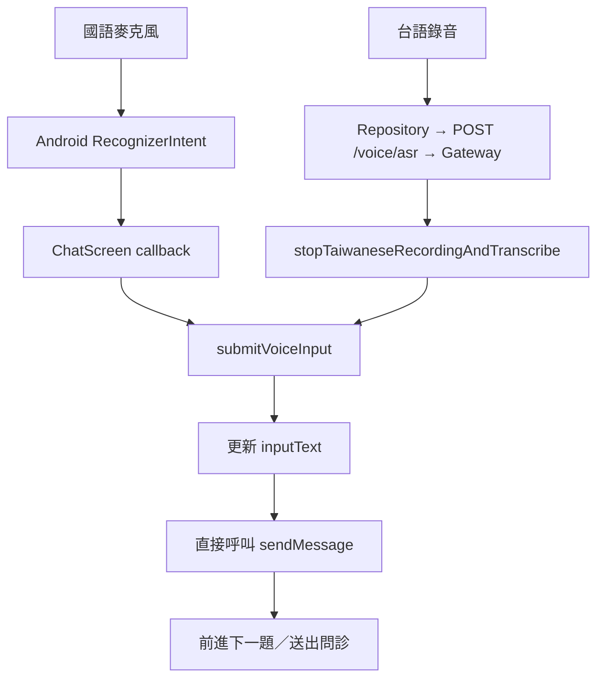
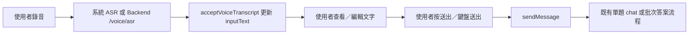
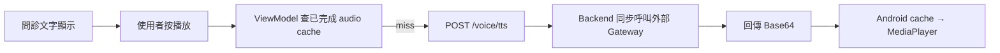
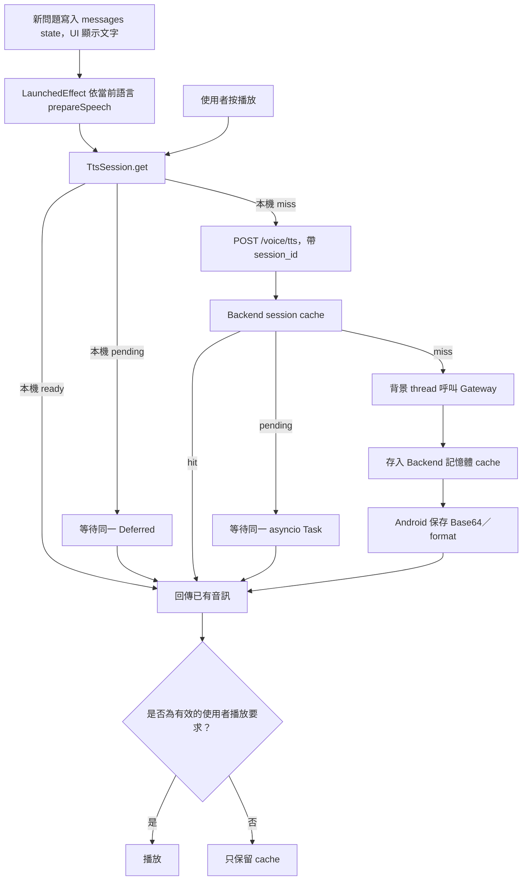

# 語音流程修改報告（2026-09-04）

目前分支：`codex0904`。開始時 `git status --short --branch` 只有 `## codex0904...origin/codex0904`，沒有尚未提交的修改。本次直接修改目前工作樹，沒有 commit、push、切換分支或 reset，沒有修改 .env、金鑰、正式 DB、醫療資料或推薦／掛號 schema。

## A. 修改前 ASR 實際流程



- 國語是 Android 系統辨識，不是 Backend ASR；保留原選擇。
- 台語透過 `AudioRecorder`、`MedicalRepository.transcribeVoice`、`MedicalApiClient.voiceAsr` 送到 `/voice/asr`，Backend 呼叫外部 Voice Gateway。
- 另外存在沒有畫面呼叫者的 ViewModel 舊路徑：`stopVoiceRecordingAndSend`／`sendPresetTaiwaneseAudio` → `/voice/chat` → ASR、chat、TTS，並在回應後自動播放。本次移除這些 ViewModel 舊路徑。
- 舊測試音檔錄音入口 `startPresetVoiceInput` 會先清空草稿；本次一併移除無呼叫者的測試入口。

## B. 修改後 ASR 實際流程



- 國語 callback 呼叫 `finishSystemVoiceInput`，解除錄音狀態後只更新草稿；重複 callback 被忽略。
- 台語 ASR 成功只呼叫 `acceptVoiceTranscript`，沒有 send、submit、導航或播放。
- 空辨識、取消、ASR 錯誤不修改原草稿；loading 在完成後恢復，錯誤顯示在輸入區。
- 錄音／ASR 期間禁止送出與切換語言。國語錄音啟動也有同步 guard。
- ASR coroutine 取消有世代編號保護，舊請求的回應／finally 不會改寫新請求狀態。
- 原有 `_isAiThinking` guard 提前到 coroutine 排程前設定，快速重按送出不會排入第二個相同請求。
- **保留既有 Batch 行為**：初診／複診的同批問題逐題按送出、逐題保存答案；最後一題才把 keyed answers 一次送 Backend。沒有改成每個欄位都打一個新的 chat API。

## C. 修改前 TTS 實際流程



Android 原 cache key 是 `message.id | lang | content.hashCode()`。沒有預生成、共享進行中請求、session cleanup API 或 TTL；同一句換 message id 會重新生成。Backend `/voice/tts` 沒有 cache，阻塞式 gateway 呼叫直接執行在 async route 裡。

## D. 修改後 TTS 預生成與 cache 流程



- 預生成只處理新顯示的 AI 文字與使用者選定的語言；不預先合成兩種語言，不自動播放。
- 相同 session、相同文字、相同語言共用本機 Deferred；相同 Backend key 共用 asyncio Task。
- 按播放時 ready 音訊直接交給播放器，不再等外部生成；pending 時共用既有請求。
- 停止／改播／切題／離開畫面會取消播放等待、停止目前音訊及系統朗讀；已送出的預生成可以完成並存回它自己的題目 key。
- `publishMessages` 在新題 state 發布時就使舊播放失效，不必等待 Compose 重組。
- 所有等待後與播放器 callback 都檢查播放世代、session 身分和 closed 狀態，避免播錯題。
- 背景失敗只記 log，不影響文字 UI；使用者按播放可重試。台語失敗沿用國語 Gateway、再到 Android 系統朗讀的降級流程，降級也只由播放操作觸發。
- Gateway 阻塞式呼叫移到 `asyncio.to_thread`。`/voice/asr` 與保留的舊 `/voice/chat` gateway 呼叫也移出 event loop。

## E. TTS cache 存在哪裡

| 層級 | 儲存方式 |
|---|---|
| Backend | `TtsSessionCache.sessions` 記憶體 dictionary，保存 Base64／format 及生成中的 Task |
| Android | Repository 持有當前 `TtsSession`，保存 Base64／format 與 Deferred；跨推薦頁導航保留同次 session |
| 播放暫存檔 | Android `cacheDir/tts_*.wav` 等格式；每次播放建立唯一暫存檔，播放完成、替換或離開畫面時刪除 |

音訊不寫入正式 DB、SharedPreferences、歷史紀錄或永久 Backend 檔案。

## F. Cache key

- Android 每次 `startNewConversation`、開啟另一筆 history 時建立獨立隨機 UUID session；與 Backend case id 分開，因此取得第一個 case id 前也能準備音訊。
- Backend：`session UUID + SHA-256(text.trim()) + lang + speed`。
- Android：每個 `TtsSession` 內使用 `(text.trim(), lang)`；目前 Android 語速固定 1.0。未來若增加可調語速，本機 key 也必須增加 speed。
- 相同文字即使換 message id，仍能命中；不同 session／不同題文字／不同語言不會誤用。

## G. Hit／miss 與重試

- 本機 hit：直接回已有結果，無 HTTP。
- 本機 pending：等待同一 Deferred，不重送 HTTP；取消單一播放 waiter 不會取消共享生成。
- Backend hit：直接回已保存的音訊，無 Gateway 生成。
- Backend pending：等待同一 Task；HTTP caller 取消不會取消其他 caller 共用的生成。
- Miss：沒有音訊也沒有 pending 才建立生成。
- Backend 生成失敗或回空音訊不保存成功 cache，後續可以重試。
- Android 暫存失敗狀態避免重組反覆預生成；只有明確播放重試、session TTL 到期或新 session 才重新嘗試。

## H. 什麼時候清 cache

1. 使用者在完成問診／推薦後的「準備好了嗎」確認彈窗按「確認」，準備前往榮總 App。
2. 開始新的聊天 session／開啟另一筆 history：關閉前一個本機 session，背景盡力清理 Backend 舊 session。
3. Backend、Android 閒置 TTL 到期。
4. Backend process 重啟、Android process 結束時，記憶體 cache 自然消失。

問診期間不因前往下一題、前往醫師推薦頁或 ChatScreen dispose 就清除 session 音訊，因此同次 session 的 Q1／Q2／Q3 可重播。

## I. 榮總 App 跳轉 cleanup 位置

實際觸發檔案：`android/app/src/main/java/com/example/medicalaiguidance/screen/ConfirmNeedScreen.kt` 的確認彈窗按鈕。

呼叫鏈：

```text
ConfirmNeedScreen 確認
→ ConfirmViewModel.launchHospitalAfterVoiceCleanup
→ MedicalRepository.cleanupTtsBeforeHospitalLaunch
→ currentTtsSession.close（立即清本機、取消 pending）
→ POST /voice/tts/cleanup（最長等候 1.5 秒）
→ getLaunchIntentForPackage("tw.com.bicom.VGHTPE")
→ startActivity（未安裝時維持原本網站 fallback）
```

HTTP 清理在獨立 coroutine scope 執行，避免 blocking HTTP 取消等待拖住 Intent；失敗／逾時記錄 Android log，照常跳轉。重複確認也有 guard。原有 Accessibility target、推薦、掛號資料與 Intent package 均保留。

搜尋亦確認 `HomeScreen` 的取消掛號入口與 `MockScheduleTestScreen` 的測試入口會啟動院方 App；它們不是本次「完成問診後確認掛號」的 session 結束入口，未更動其行為。

## J. Fallback TTL／cleanup

- Backend：30 分鐘未存取的 session 音訊過期；每次 cache 存取／cleanup 先 prune，另由 app startup 啟動每 60 秒的 sweep。無新流量也會清掉過期音訊，通常最多約 31 分鐘。
- 顯式 cleanup 清除指定 UUID、取消它的 pending，保留 30 分鐘短期 closed 記錄，阻止晚到的 POST 把已結束的 session 重新填回。closed 記錄也會過期。
- 閒置 TTL eviction 不永久封鎖仍開啟的問診，後續可重新生成。
- 已發出的外部 blocking HTTP 不一定能中止；即使它稍後完成，也不會再填回已清除的 cache。
- Android：30 分鐘未透過本機 session 存取時清掉已完成 cache；新 session／主要結束點會立即清除。
- Android MainActivity 啟動時刪除 `cacheDir` 中超過 30 分鐘的 `tts_` 檔案。正常播放完成／release 立即刪除；若 process 在播放中被殺，殘留檔於之後 App 啟動時清理。沒有聲稱 App 永遠不再啟動時仍能執行清理。

## K. 修改檔案

下列路徑皆相對於本專案根目錄。

| 檔案 | 修改內容 |
|---|---|
| `backend/app/services/tts_cache.py`（新增） | session 記憶體 cache、共享 Task、SHA-256 key、TTL、cleanup 與晚到結果保護 |
| `backend/app/routes/voice.py` | 擴充 `/voice/tts`、新增 cleanup API、語速驗證／傳遞、Gateway 呼叫移出 event loop |
| `backend/app/main.py` | 啟動 60 秒 sweep，shutdown 清除暫存任務與音訊 |
| `backend/tests/test_tts_cache.py`（新增） | 16 項 cache、併發、隔離、清理、TTL、ASR／文字路徑測試 |
| `android/app/.../repository/TtsSession.kt`（新增） | UUID session、本機結果／Deferred 共用、TTL、close |
| `android/app/.../repository/MedicalRepository.kt` | 管理當前 session，開始新 session 時清舊 cache，跳轉前限時清理 |
| `android/app/.../network/MedicalDtos.kt` | TtsRequest 增加可選 sessionId，序列化 session_id |
| `android/app/.../network/MedicalApiClient.kt` | cleanup API client、cleanup 專用短 timeout，原 API timeout 保持原值 |
| `android/app/.../viewmodel/ChatViewModel.kt` | ASR 只填草稿、移除舊自動問診／播放路徑、送出 guard、預生成與播放失效保護 |
| `android/app/.../screen/ChatScreen.kt` | callback 填草稿、新題／語言觸發預生成、離頁停止、顯示語音狀態、錄音中禁止切語言 |
| `android/app/.../viewmodel/ConfirmViewModel.kt` | 跳轉前 cleanup 與重複點擊 guard |
| `android/app/.../screen/ConfirmNeedScreen.kt` | 確認按鈕先清 cache，再執行既有 Intent |
| `android/app/.../util/AudioPlayer.kt` | 唯一暫存檔名、異常時可刪檔、啟動時過期檔清理 |
| `android/app/.../util/SystemTextSpeaker.kt` | 可停止 pending 系統朗讀，callback 回主執行緒檢查播放狀態 |
| `android/app/.../MainActivity.kt` | App 啟動清理過期 TTS 暫存檔 |
| `android/app/src/test/.../VoiceFlowUnitTest.kt`（新增） | 9 項 Android 語音、cache 與重複送出回歸測試 |
| `android/app/build.gradle.kts` | 新增 test-only kotlinx-coroutines-test 1.9.0，與既有 coroutine runtime 版本相同 |
| `docs/VOICE_FLOW_REPORT_2026-09-04.md`（新增） | 本報告 |

`android/app/.../` 完整前綴為 `android/app/src/main/java/com/example/medicalaiguidance/`；測試完整前綴為 `android/app/src/test/java/com/example/medicalaiguidance/`。

## L. API 變動

**沿用並擴充 POST `/voice/tts`**：

```json
{
  "text": "請描述目前症狀",
  "lang": "chinese",
  "speed": 1.0,
  "session_id": "11111111-1111-4111-8111-111111111111"
}
```

回應維持 `audio_base64`、`audio_format`、`tts_failed`、`error`。session_id 可省略，以保留舊 client；省略時不使用 session cache。speed 接受 0.25–4.0，會真正傳給 Gateway；非法 speed／session UUID 回 400。

**新增 POST `/voice/tts/cleanup`**：

```json
{"session_id": "11111111-1111-4111-8111-111111111111"}
```

成功回 `{"session_id":"...","cleared":true}`，重複清理亦成功。即使語音功能關閉／Gateway 不可用，cleanup 仍可執行。只作用於該 UUID。

`/voice/asr` 回應 schema 不變。Backend 舊 `/voice/chat` 及 Repository／API client 相容方法仍保留，但目前 Android ChatScreen／ChatViewModel 沒有呼叫它；若其他外部舊 client 直接呼叫，該 API 的 ASR→chat→TTS 原契約仍存在。沒有修改 `/chat`、`/recommend`、`/followup/recommend`、`/generate_script` 的業務邏輯或 schema。

## M. 測試與結果

**Backend 最終指令**（backend 工作目錄，僅本次 process 停用 .env，不修改檔案）：

```powershell
& .venv/Scripts/python.exe -c "from app.config import Settings; Settings.model_config['env_file']=None; import pytest; raise SystemExit(pytest.main(['tests','-q']))"
```

結果：**175 passed、24 subtests passed、0 failed**。其中新增 16 項語音測試，包含 cache hit／miss、重複 12 callers 共用生成、語言／語速／文字／session 隔離、caller cancellation、cleanup 不影響別人、pending cleanup、失敗重試、空音訊、TTL、closed 記錄到期、API 契約、ASR 不呼叫 chat／TTS、Gateway failure 後文字問診仍可用，以及 TTS 生成尚未完成時 `/chat` 仍能回應。

**Android 最終指令**（android 工作目錄）：

```powershell
$env:JAVA_HOME='C:\Program Files\Android\Android Studio\jbr'
.\gradlew.bat testDebugUnitTest assembleDebug --no-daemon --offline
```

結果：**61 tests、0 failures、0 errors、0 skipped**。其中新增 9 項測試，涵蓋 ASR 草稿可編輯、空結果／取消保留草稿、重複系統 callback、快速送出 guard、預生成與播放共享 pending、取消單一 waiter、跨題／語言／session 隔離、失敗重試、close、TTL 與 request 序列化。

靜態檢查確認：`ChatViewModel` 只有 `sendMessage` 的宣告，沒有 ASR 內部呼叫它；ChatScreen 只有使用者送出路徑呼叫。播放器與系統朗讀只在 `speakMessage` 的明確播放要求路徑使用。`git diff --check` 通過。

既有初診、複診、回診、推薦、掛號 script、visit type、history、安全 gate 回歸測試一併通過；未以真實院方 App 或正式 DB 重跑完整整合流程。所有新增 Gateway 生成皆為 mock，未付費呼叫外部 AI／TTS。

## N. Android build

**最終 `assembleDebug`：BUILD SUCCESSFUL**。APK：`android/app/build/outputs/apk/debug/app-debug.apk`。

初次 sandbox 執行曾無法存取 Python／下載 Gradle；允許測試執行後可正常使用既有 Python、Java、SDK 與依賴。加入輸入區狀態顯示時曾出現 Compose Column 參數錯誤，已修正並重新跑完整測試與 build。

仍有 SDK XML 版本與既有 Compose icon deprecation 警告；Backend 亦有既有 Starlette TestClient、沿用的 FastAPI on_event deprecation 警告，均非測試失敗。

## O. 風險與未驗證項目

- 與現有 case_store／Procfile 部署方式一致，**Backend cache 是單一 worker 記憶體**。多 worker／多 instance 不共用 cache、pending 或 cleanup；若未來擴展部署，需要共享暫存與跨 process lock，本次沒有引入 Redis 或改 DB。
- Session UUID 是隔離識別，不是新增的使用者認證／授權層；沿用既有 API 的存取模型。
- 本次沒有測量真實外部 TTS 延遲。預生成尚未完成時仍需要等既有請求；cold start、網路與 Gateway 失敗無法由 cache 消除。
- 尚未實機驗證國語辨識 Activity、台語麥克風、真實音訊播放、旋轉／程序回收、榮總 App Intent、Accessibility 全流程。測試成功不能代替上述裝置驗證。
- 舊 `/voice/chat` 契約仍存在供相容 client 使用；新的 Android 問診語音不走該端點。
- Backend 重啟會失去 cache；Android 重啟後會建立新的 session，舊 Backend cache 由 TTL 清除。
- 外部 TTS 請求送出後可能無法取消其計算；取消或清理可保證不誤播、不回填已關閉的 cache，不能保證下游即刻停止工作。

## P. git diff --stat

以下保存完成時的實際輸出。Git 的 diff --stat 不包含 untracked 新檔；新增檔案完整列於 K 與 Q，沒有為了取得統計而 git add。

```text
 android/app/build.gradle.kts                       |   1 +
 .../com/example/medicalaiguidance/MainActivity.kt  |   2 +
 .../medicalaiguidance/network/MedicalApiClient.kt  |  12 +-
 .../medicalaiguidance/network/MedicalDtos.kt       |   4 +-
 .../repository/MedicalRepository.kt                |  39 +-
 .../example/medicalaiguidance/screen/ChatScreen.kt |  40 +-
 .../medicalaiguidance/screen/ConfirmNeedScreen.kt  |  14 +-
 .../example/medicalaiguidance/util/AudioPlayer.kt  |  16 +-
 .../medicalaiguidance/util/SystemTextSpeaker.kt    |  16 +-
 .../medicalaiguidance/viewmodel/ChatViewModel.kt   | 503 ++++++---------------
 .../viewmodel/ConfirmViewModel.kt                  |  16 +
 backend/app/main.py                                |  21 +
 backend/app/routes/voice.py                        |  45 +-
 13 files changed, 323 insertions(+), 406 deletions(-)
```

## Q. 最後 git status

```text
## codex0904...origin/codex0904
 M android/app/build.gradle.kts
 M android/app/src/main/java/com/example/medicalaiguidance/MainActivity.kt
 M android/app/src/main/java/com/example/medicalaiguidance/network/MedicalApiClient.kt
 M android/app/src/main/java/com/example/medicalaiguidance/network/MedicalDtos.kt
 M android/app/src/main/java/com/example/medicalaiguidance/repository/MedicalRepository.kt
 M android/app/src/main/java/com/example/medicalaiguidance/screen/ChatScreen.kt
 M android/app/src/main/java/com/example/medicalaiguidance/screen/ConfirmNeedScreen.kt
 M android/app/src/main/java/com/example/medicalaiguidance/util/AudioPlayer.kt
 M android/app/src/main/java/com/example/medicalaiguidance/util/SystemTextSpeaker.kt
 M android/app/src/main/java/com/example/medicalaiguidance/viewmodel/ChatViewModel.kt
 M android/app/src/main/java/com/example/medicalaiguidance/viewmodel/ConfirmViewModel.kt
 M backend/app/main.py
 M backend/app/routes/voice.py
?? android/app/src/main/java/com/example/medicalaiguidance/repository/TtsSession.kt
?? android/app/src/test/java/com/example/medicalaiguidance/VoiceFlowUnitTest.kt
?? backend/app/services/tts_cache.py
?? backend/tests/test_tts_cache.py
?? docs/VOICE_FLOW_REPORT_2026-09-04.md
```

完成後停在目前工作樹，等使用者確認；未 commit、未 push。
